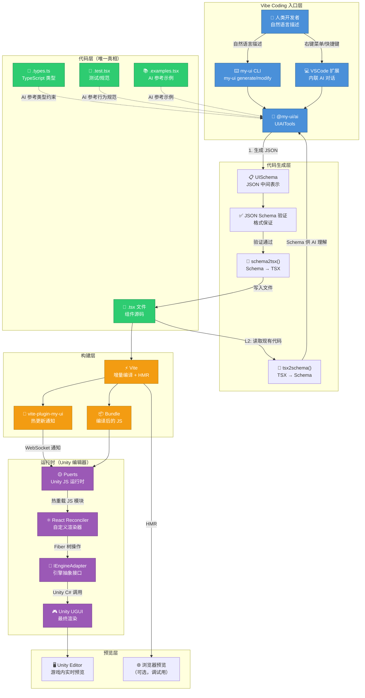
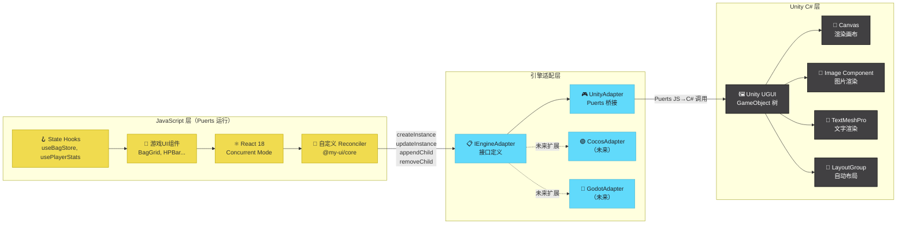
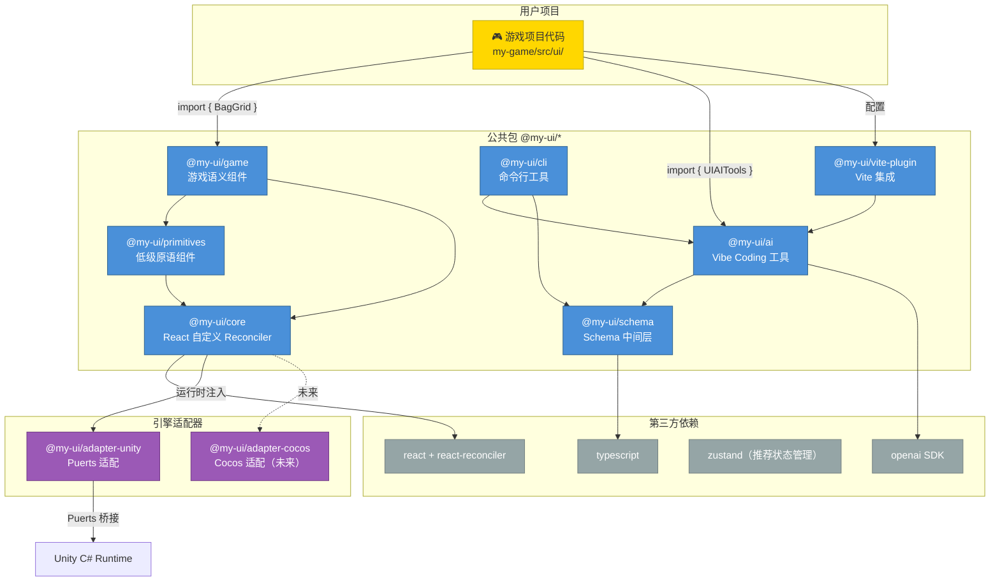
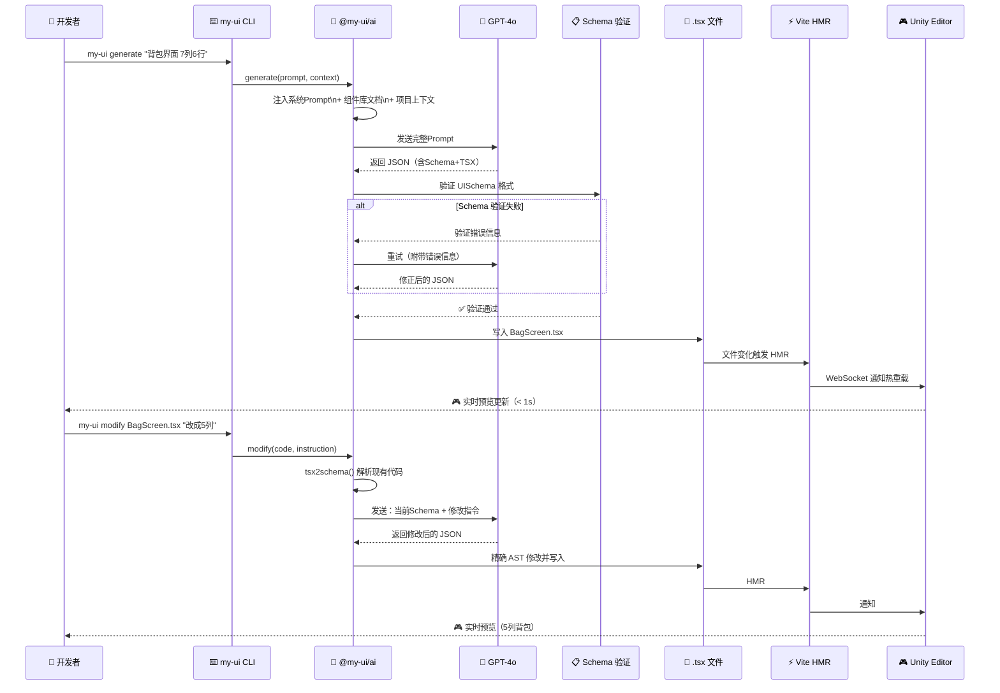

# 支持 Vibe Coding 的跨引擎游戏 UI 框架 · 架构设计方案

> 版本：v1.0 · 日期：2026-03-12  
> 关键词：React TSX · Puerts · Unity · Vibe Coding · AI-First · 跨引擎

---

## 目录

1. [为什么这套框架天然支持 Vibe Coding](#1-为什么这套框架天然支持-vibe-coding)
2. [Vibe Coding 的核心设计目标](#2-vibe-coding-的核心设计目标)
3. [AI-First API 设计原则](#3-ai-first-api-设计原则)
4. [Schema 驱动层（AI 的中间语言）](#4-schema-驱动层ai-的中间语言)
5. [内置 AI 工具包 @my-ui/ai](#5-内置-ai-工具包-my-uiai)
6. [高级语义组件库（游戏 UI 专用）](#6-高级语义组件库游戏-ui-专用)
7. [开发时工作流设计（Vibe Coding 体验）](#7-开发时工作流设计vibe-coding-体验)
8. [让 AI 更好生成代码的工程设计](#8-让-ai-更好生成代码的工程设计)
9. [与 FairyGUI 的 Vibe Coding 能力对比](#9-与-fairygui-的-vibe-coding-能力对比)
10. [完整架构总览图](#10-完整架构总览图)
11. [分阶段实施路线](#11-分阶段实施路线)

---

## 1. 为什么这套框架天然支持 Vibe Coding

### 1.1 Vibe Coding 的本质需求

Vibe Coding 不是简单地"让 AI 写代码"，而是建立一套**人类意图 → AI 理解 → 代码生成 → 即时验证 → 迭代**的闭合循环。这个循环有四个关键摩擦点：

| 摩擦点 | 描述 | 框架解法 |
|--------|------|---------|
| **表达摩擦** | AI 需要把自然语言转成什么格式？ | TSX = 最接近自然语言的 UI 描述 |
| **验证摩擦** | 生成的代码对不对，怎么快速知道？ | TypeScript 类型即时报错 |
| **预览摩擦** | 改完之后多久能看到效果？ | Puerts Hot Reload < 1s |
| **修改摩擦** | AI 要改某个部分，能精确定位吗？ | 声明式组件树 = 可寻址结构 |

### 1.2 TSX 是 AI 最友好的 UI 描述语言

**对比各 UI 描述格式的 AI 理解成本：**

```
FairyGUI .fui（二进制）:
  → AI 完全无法读取，必须先反编译，反编译结果可读性极差
  → 例：<com.fairygui.GButton id="n3" x="100" y="50">  （AI 理解"n3"是什么？）

Unity UGUI Prefab（YAML-like）:
  → 大量引擎内部 ID（m_ObjectHideFlags: 0, m_PrefabAsset: {fileID: 0}）
  → UI 结构被打散在多个 GameObject 层级，AI 需要脑补组件关系
  → 每改一个按钮位置，要同步修改 3-5 个字段，AI 极易出错

FairyGUI XML（编辑器导出）:
  → 包含大量编辑器元数据，非 UI 逻辑但 AI 无法区分
  → 坐标全是绝对像素值，AI 无法理解布局意图
  → 无类型系统，AI 写错属性名不会报错

本框架 TSX:
  → 结构即语义：<BagGrid cols={7} rows={4} items={bagItems} />
  → AI 的训练数据中有海量 React TSX，零学习成本
  → 组件名+props 即文档，AI 一眼知道意图
  → TypeScript 类型系统做兜底，写错立刻红线
```

具体示例，同样是"一个带关闭按钮的背包界面"：

```xml
<!-- FairyGUI XML 导出 - AI 理解成本极高 -->
<component name="BagPanel" width="600" height="500">
  <displayList>
    <image name="bg" src="ui://bag/bg" x="0" y="0" width="600" height="500"/>
    <list name="bagList" x="20" y="60" width="560" height="380" 
          columnCount="7" lineGap="4" columnGap="4" selectionMode="0">
      <item url="ui://bag/item_slot"/>
    </list>
    <button name="closeBtn" src="ui://common/close_btn" x="562" y="8"/>
    <text name="titleTxt" text="背包" x="280" y="20" fontSize="20"/>
  </displayList>
</component>
```

```tsx
// 本框架 TSX - AI 理解成本接近零
const BagPanel: FC<{ onClose: () => void }> = ({ onClose }) => (
  <Panel title="背包" onClose={onClose}>
    <BagGrid
      cols={7}
      rows={4}
      items={useBagItems()}
      onItemClick={(item) => showItemTooltip(item)}
      onItemRightClick={(item) => useItem(item)}
    />
  </Panel>
);
```

**为什么 TSX 对 AI 更友好：**

1. **结构即意图**：`<BagGrid cols={7}>` 直接表达"7列背包格子"，不需要 AI 反推
2. **Props 即文档**：`onItemClick` 比 `addEventListener('click', ...)` 更清晰
3. **训练数据优势**：全球数百万 React 项目都是 AI 的训练语料，AI 对 TSX 语法的掌握程度远超任何游戏引擎 UI 格式
4. **可组合性**：AI 天然理解 React 组件嵌套模型，可以正确组合组件

### 1.3 声明式 = AI 可预测

命令式 UI（FairyGUI/UGUI 脚本）的根本问题是**状态分散**：

```typescript
// ❌ 命令式 - AI 生成时极易出错（需要追踪状态变化链）
class BagController {
  private bagPanel: GComponent;
  private itemList: GList;
  
  open() {
    this.bagPanel = UIPackage.createObject("Bag", "BagPanel") as GComponent;
    this.itemList = this.bagPanel.getChild("bagList") as GList;
    this.itemList.numItems = GameData.bagItems.length;  // 必须记住顺序：先设数量
    this.itemList.itemRenderer = this.renderItem.bind(this); // 再设渲染器
    GRoot.inst.addChild(this.bagPanel);  // 最后加入场景
    // AI 极易遗漏某一步，或写错顺序，且运行时才报错
  }
  
  updateItem(index: number, newItem: Item) {
    // AI 需要知道："更新一个格子"的正确方式是什么？
    // getChildAt? setVirtual? itemRenderer 会重新调用吗？
    const slot = this.itemList.getChildAt(index) as GComponent;
    slot.getChild("icon").asLoader.url = newItem.iconUrl;  // 层级硬编码
    slot.getChild("count").asTextField.text = String(newItem.count); // 容易忘
  }
}
```

```tsx
// ✅ 声明式 - AI 只需理解"状态 → UI"的映射，无需追踪变化链
const BagPanel: FC = () => {
  const items = useBagStore(state => state.items);  // 读状态
  
  return (
    <BagGrid
      cols={7}
      rows={4}
      items={items}  // 状态变化 → UI 自动更新，AI 无需操心更新逻辑
    />
  );
};
// AI 的理解：items 变了，BagGrid 就更新。就这么简单。
```

**声明式对 AI 的核心价值**：
- UI = f(state)：AI 只需生成这个映射函数，不需要编写更新流程
- 副作用隔离：AI 把副作用放进 `useEffect`，主体 JSX 保持纯净
- 可预测性：同样的 props → 同样的 UI，AI 生成结果可验证

### 1.4 TypeScript 类型系统是 AI 的"护栏"

FairyGUI 的 API 是弱类型的，AI 写错不报错：

```typescript
// ❌ FairyGUI - 写错 getChild 的名字，运行时才抛 null 异常
const btn = panel.getChild("closBtn");  // "closBtn" 拼错了，IDE 不报错
btn.onClick.add(handler);  // 运行时 NullReferenceException

// ❌ FairyGUI - 设置错误的属性，IDE 不提示
item.asTextField.text = 100;  // 应该是 String(100)，但 TypeScript 不会报错
```

```typescript
// ✅ 本框架 - TypeScript 严格类型，AI 写错立刻红线
interface BagGridProps {
  cols: 1 | 2 | 3 | 4 | 5 | 6 | 7 | 8 | 9 | 10;  // 约束合法列数
  rows: number;
  items: BagItem[];
  onItemClick?: (item: BagItem, slotIndex: number) => void;
  onItemDragStart?: (item: BagItem) => void;
  emptySlotStyle?: 'dark' | 'light' | 'none';  // union type，AI 不能乱填
}

// AI 写 <BagGrid cols={0} /> → 立刻红线：Type '0' is not assignable to type '1 | 2 | ...'
// AI 写 <BagGrid items="xxx" /> → 立刻红线：Type 'string' is not assignable to 'BagItem[]'
```

**TypeScript 对 AI 的三层护栏：**

1. **语法护栏**：JSX 结构错误立刻报错（标签不匹配、属性引号缺失）
2. **类型护栏**：Props 类型错误在编辑器即报（AI 填错值类型、用错组件）
3. **语义护栏**：业务类型约束（ItemRarity、SkillType 等 enum，AI 只能填合法值）

### 1.5 Hot Reload = 极短迭代循环

Vibe Coding 的生命力在于**快速反馈**。传统游戏 UI 开发：

```
FairyGUI 工作流：
编辑器拖拽 → 导出 .fui → Unity 重新导入 → 运行游戏 → 看效果
耗时：30s ~ 2min（取决于资源量）

本框架 Vibe Coding 工作流：
AI 生成 TSX → 文件保存 → Vite HMR → Puerts 热更新 → Unity 内实时刷新
耗时：< 1s（Puerts 支持脚本热重载，无需重启游戏）
```

这 **30 倍的速度差**意味着：
- AI 生成一个不满意的方案，可以立刻再生成一个，成本极低
- 人类可以"感受"UI，而不是"想象"UI
- Vibe Coding 的核心假设（快速迭代比精确生成更重要）成立

### 1.6 纯代码工作流 = AI 可直接操作

FairyGUI 的 AI 集成障碍：
- 设计资源存在编辑器内部的 `.fui` 二进制文件，AI 不可读写
- AI 要改一个按钮位置，必须通过 GUI 工具，无法通过代码指令
- AI 无法批量修改或重构（无法"把所有面板的关闭按钮移到右上角"）

本框架：
- **所有 UI 都是 `.tsx` 文件**，AI 可直接读取理解、修改
- 支持批量操作（正则替换、AST 转换）
- Git 版本控制：AI 的每次生成都有 diff，可回滚
- CI/CD 可接入：AI 生成的代码可自动测试

---

## 2. Vibe Coding 的核心设计目标

### 2.1 三层 Vibe Coding 工作流

```
L3: 图片 → UI（设计稿驱动）
     ↓ 截图/Figma 导出 → Vision Model → TSX
L2: 精确修改（意图驱动）
     ↓ "把格子从7列改成5列" → 定位 → 精确 AST 修改 → TSX
L1: 全量生成（描述驱动）
     ↓ "生成一个RPG背包界面" → 上下文注入 → LLM → TSX
```

### 2.2 L1：AI 生成完整 UI 页面

**目标**：用户描述一句话，AI 生成可运行的完整界面

**框架如何支持 L1：**

1. **高级语义组件库**（见第6节）：AI 不需要从 `<div>` 从头写，直接用 `<BagGrid>`
2. **Prompt 注入系统**：框架在上下文中注入可用组件列表和 props 约束
3. **Schema 中间层**（见第4节）：AI 先输出 JSON Schema，验证后再转 TSX，减少语法错误

```typescript
// L1 示例：用户输入 "生成一个RPG背包界面，7列6行，右上角有关闭按钮"
// AI 输出的 TSX：

import { Panel, BagGrid, useBagStore } from '@my-ui/game';

/**
 * RPG 背包界面
 * AI 生成 @ 2026-03-12 10:30
 * 提示词: "生成一个RPG背包界面，7列6行，右上角有关闭按钮"
 */
export const BagScreen: FC<{ onClose: () => void }> = ({ onClose }) => {
  const { items, gold } = useBagStore();
  
  return (
    <Panel
      title="背包"
      width={560}
      height={480}
      closeButton="top-right"
      onClose={onClose}
    >
      <BagGrid
        cols={7}
        rows={6}
        items={items}
        onItemClick={(item, index) => console.log('点击', item.name, '位于槽', index)}
      />
      <StatusBar>
        <GoldDisplay amount={gold} />
      </StatusBar>
    </Panel>
  );
};
```

**框架在 L1 层做的设计工作**：
- 每个组件都有 JSDoc `@example` 标注（AI 生成时的参考模板）
- `index.ts` 统一导出，AI 只需 `import from '@my-ui/game'`
- 组件名和 props 名遵循游戏 UI 领域惯例，AI 能猜对大多数

### 2.3 L2：AI 对现有 UI 做精确修改

**目标**：对现有代码库的 UI，AI 能理解并精确修改局部，不破坏其他部分

**核心挑战**：AI 需要"定位 + 修改"而不是"重写"

**框架如何支持 L2：**

1. **组件粒度恰当**：每个文件对应一个逻辑 UI 单元（背包 = `BagScreen.tsx`），AI 的修改范围清晰
2. **Props 显式化**：所有可配置项都在 Props 中，AI 修改 `cols={7}` → `cols={5}` 即可，不需要理解内部实现
3. **`explain()` API**：AI 修改前先调用 `explain(code)` 理解现有代码结构

```typescript
// L2 示例："把背包格子从7列改成5列，同时调整面板宽度"
// AI 的操作步骤：

// Step 1: 读取文件（AI 直接 read file，FairyGUI 做不到）
const code = fs.readFileSync('src/ui/BagScreen.tsx', 'utf-8');

// Step 2: 理解现有代码（可选）
const explanation = await UIAITools.explain(code);
// → "BagScreen 是背包主界面，包含 Panel 容器和 BagGrid。BagGrid 当前 cols=7, rows=6"

// Step 3: 精确修改（AST 级别，不是字符串替换）
const modified = await UIAITools.modify(code, {
  instruction: "把格子从7列改成5列，Panel宽度相应缩小",
  mode: 'ast',  // AST 修改，保留所有注释和格式
});

// 修改结果：只改了 cols 和 width，其他代码原封不动
// <BagGrid cols={5} rows={6} ... />  ← cols: 7 → 5
// <Panel width={420} ...>  ← width: 560 → 420（自动计算）
```

**L2 关键设计约束**：
- 避免"魔法数字"：`width={560}` 应写成 `width={GRID_COLS * SLOT_SIZE + PADDING * 2}`，AI 修改 `GRID_COLS` 时宽度自动联动
- 状态提升：变化频繁的参数提升为 `const` 常量或 props，降低修改时的影响范围

### 2.4 L3：AI 看图生成 UI

**目标**：给 AI 一张截图或设计稿，输出可运行的 TSX

**框架如何支持 L3：**

1. **视觉→语义组件映射**：AI 分析图片后，先识别出"这是背包格子"/"这是技能栏"，直接映射到对应的高级组件
2. **`fromImage()` API**：封装 Vision Model 调用，注入组件库上下文（告诉模型"你有哪些组件可用"）
3. **布局分析提示词**：专门的 Prompt 模板，引导 Vision Model 输出结构化布局信息

```typescript
// L3 示例：截图 → TSX
const imageBase64 = getScreenshot(); // 从设计稿截图

const tsx = await UIAITools.fromImage(imageBase64, {
  hint: "这是一个游戏背包界面截图",
  targetComponents: ['BagGrid', 'EquipSlot', 'Panel'],  // 缩小候选范围
});

// 输出：
// <Panel title="背包" width={560} height={480}>
//   <BagGrid cols={7} rows={4} />
//   <EquipSection>
//     <EquipSlot slot="weapon" />
//     <EquipSlot slot="armor" />
//   </EquipSection>
// </Panel>
```

---

## 3. AI-First API 设计原则

### 3.1 Props 语义化设计

**原则**：AI 看到组件名和 props，不需要查文档就能猜出正确用法。

**反例（FairyGUI 风格）**：
```typescript
// ❌ AI 需要查文档：selectionMode=0 是什么意思？lineGap 是列间距还是行间距？
list.selectionMode = 0;
list.lineGap = 4;
list.columnGap = 4;
list.columnCount = 7;
```

**正例（本框架）**：
```typescript
// ✅ AI 一眼明白：列间距、行间距、列数，语义清晰
<BagGrid
  cols={7}
  colGap={4}      // colGap = column gap，列间距
  rowGap={4}      // rowGap = row gap，行间距
  selectable={false}  // 布尔值，是否可选中
/>
```

**语义化 Props 的三个层次**：

```typescript
// 层次1：能做什么（行为 props）
interface ActionProps {
  onItemClick?: (item: Item, index: number) => void;   // 点击触发
  onItemHover?: (item: Item, index: number) => void;   // 悬停触发
  onItemDragStart?: (item: Item) => void;              // 开始拖拽
  onItemDrop?: (from: number, to: number) => void;     // 拖拽放置
}

// 层次2：长什么样（外观 props）
interface AppearanceProps {
  theme?: 'dark' | 'light' | 'wood' | 'metal';   // 主题皮肤
  slotSize?: 'sm' | 'md' | 'lg';                 // 格子尺寸（语义化，非像素）
  showItemCount?: boolean;                         // 是否显示数量角标
  showRarityBorder?: boolean;                      // 是否显示品质边框
}

// 层次3：数据是什么（数据 props）
interface DataProps {
  items: BagItem[];          // 当前物品数据
  maxItems?: number;         // 背包总容量（决定空格子数量）
  lockedSlots?: number[];    // 锁定的槽位索引
}
```

### 3.2 自解释命名系统

**规则**：`组件名 + Props 名 = 完整意图表达`

```typescript
// 读出来就是：背包格子，7列，点击物品时调用onItemClick
<BagGrid cols={7} onItemClick={handleClick} />

// 读出来就是：HP血量条，当前值80，最大值100，显示数字
<HPBar current={80} max={100} showNumbers />

// 读出来就是：技能栏，6个槽位，显示冷却时间
<SkillBar slotCount={6} showCooldown />

// 读出来就是：NPC对话框，说话者是村长，显示选项
<DialogBox
  speakerName="村长"
  speakerAvatar={villagerChief.avatar}
  content="欢迎来到村子，勇者！"
  choices={[
    { id: 'quest', label: '有什么任务吗？' },
    { id: 'shop', label: '我想买东西' },
    { id: 'leave', label: '先这样，再见' },
  ]}
  onChoiceSelect={(choiceId) => handleDialogChoice(choiceId)}
/>
```

### 3.3 约束优于自由

**设计哲学**：给 AI 太多自由度反而增加错误率。严格的类型约束是 AI 的朋友。

```typescript
// ❌ 过于自由（AI 可以填任意字符串，错误运行时才发现）
interface BadProps {
  position: string;      // AI 可能填 "top_right"、"topRight"、"TR" 等各种形式
  size: string;          // AI 可能填 "large"、"big"、"xl" 等
  theme: string;         // AI 可能填任何字符串
}

// ✅ 严格约束（AI 只能填合法值，写错立刻报错）
type CloseButtonPosition = 'top-right' | 'top-left' | 'bottom-right' | 'none';
type ComponentSize = 'xs' | 'sm' | 'md' | 'lg' | 'xl';
type UITheme = 'dark-fantasy' | 'light-minimal' | 'wood-classic' | 'metal-sci-fi';

interface GoodProps {
  closeButtonPosition?: CloseButtonPosition;  // AI 用 IDE 自动补全，不会猜错
  size?: ComponentSize;
  theme?: UITheme;
}
```

**特别重要的约束模式**：

```typescript
// 1. 装备槽类型 - AI 一定会用 union type 而不是魔法字符串
type EquipSlotType =
  | 'weapon-main'
  | 'weapon-off'
  | 'armor-head'
  | 'armor-chest'
  | 'armor-legs'
  | 'armor-feet'
  | 'ring-left'
  | 'ring-right'
  | 'necklace'
  | 'trinket';

// 2. 物品品质 - 颜色编码内置在类型中，AI 不需要查"蓝色是什么品质"
type ItemRarity =
  | 'common'      // 白色
  | 'uncommon'    // 绿色
  | 'rare'        // 蓝色
  | 'epic'        // 紫色
  | 'legendary'   // 橙色
  | 'mythic';     // 红色

// 3. 伤害类型 - 游戏领域专用
type DamageType =
  | 'physical'
  | 'magic'
  | 'fire'
  | 'ice'
  | 'lightning'
  | 'poison'
  | 'holy'
  | 'dark'
  | 'true';  // 真实伤害（无视防御）
```

### 3.4 高级语义组件 vs 低级原语的分层设计

```
┌─────────────────────────────────────────────────┐
│  高级语义层（游戏 UI 专用）                        │
│  BagGrid, SkillBar, HPBar, DialogBox...          │
│  → AI 首选层，覆盖 80% 的游戏 UI 需求             │
├─────────────────────────────────────────────────┤
│  中级布局层（通用游戏 UI）                         │
│  Panel, Popup, HUD, Overlay, StatusBar...        │
│  → AI 用于组合高级组件                             │
├─────────────────────────────────────────────────┤
│  低级原语层（引擎无关）                             │
│  View, Text, Image, Button, Input, ScrollView... │
│  → AI 在高级组件不满足需求时使用                    │
├─────────────────────────────────────────────────┤
│  引擎适配层（内部，AI 不直接接触）                  │
│  IEngineAdapter, UnityAdapter, CocosAdapter...   │
└─────────────────────────────────────────────────┘
```

**分层的核心价值**：AI 优先使用高级语义组件，不仅代码量少，还自动获得内置的游戏 UI 最佳实践（如背包的拖拽排序、技能的冷却动画、血条的平滑过渡）。

---

## 4. Schema 驱动层（AI 的中间语言）

### 4.1 为什么需要 Schema 中间层？

直接让 AI 输出 TSX 有一个问题：**TSX 是代码，AI 生成代码有语法错误的风险**。Schema 是结构化数据，可以在转 TSX 之前用 JSON Schema 验证。

```
流程对比：

传统方式：
User prompt → AI 直接输出 TSX → 可能有语法错误 → 运行时才发现

Schema 驱动：
User prompt → AI 输出 UISchema (JSON) → JSON Schema 验证 → schema2tsx() → 类型安全的 TSX
                                        ↑
                              如果验证失败，立刻告知 AI 重试，快速纠错
```

### 4.2 UISchema 完整类型定义

```typescript
// packages/schema/src/types.ts

/** 基础节点类型 */
type UINodeType =
  // 高级语义组件
  | 'panel'
  | 'bag-grid'
  | 'equip-slot'
  | 'skill-bar'
  | 'hp-bar'
  | 'mp-bar'
  | 'chat-box'
  | 'quest-log'
  | 'dialog-box'
  | 'mini-map'
  | 'floating-damage'
  | 'tooltip-card'
  // FairyGUI 对标新增
  | 'game-window'
  | 'popup-menu'
  | 'dropdown-select'
  | 'skill-tree'
  | 'spine-viewer'
  | 'screen-effect'
  | 'sprite-animation'
  // 低级原语
  | 'view'
  | 'text'
  | 'richtext'
  | 'image'
  | 'button'
  | 'scroll-view'
  | 'graph'
  | 'movieclip'
  | 'combobox'
  | 'tree'
  | 'loader3d'
  | 'engine-object';

/** 布局约束 */
interface LayoutSchema {
  x?: number;
  y?: number;
  width?: number | 'fill' | 'wrap';
  height?: number | 'fill' | 'wrap';
  anchor?: 'top-left' | 'top-center' | 'top-right' | 'center' | 'bottom-left' | 'bottom-right';
  pivot?: { x: number; y: number };
  flexDirection?: 'row' | 'column';
  gap?: number;
  padding?: number | { top?: number; right?: number; bottom?: number; left?: number };
  alignItems?: 'start' | 'center' | 'end' | 'stretch';
  justifyContent?: 'start' | 'center' | 'end' | 'space-between' | 'space-around';
}

/** 样式约束 */
interface StyleSchema {
  backgroundColor?: string;  // '#RRGGBBAA' 格式
  backgroundImage?: string;  // 资产路径 'ui://atlas/sprite_name'
  borderColor?: string;
  borderWidth?: number;
  borderRadius?: number;
  opacity?: number;          // 0-1
  visible?: boolean;
}

/** 单个 UI 节点 Schema */
export interface UINodeSchema {
  /** 节点类型，决定渲染哪个组件 */
  type: UINodeType;
  
  /** 节点唯一标识，用于 L2 精确修改定位 */
  id?: string;
  
  /** 布局 */
  layout?: LayoutSchema;
  
  /** 样式 */
  style?: StyleSchema;
  
  /** 组件特定 props（依 type 不同而不同） */
  props?: Record<string, unknown>;
  
  /** 子节点 */
  children?: UINodeSchema[];
  
  /** 事件绑定（字符串引用，转 TSX 时转为函数调用） */
  events?: {
    onClick?: string;         // e.g. "handleClose"
    onItemClick?: string;     // e.g. "handleItemClick"
    onChoiceSelect?: string;
    [key: string]: string | undefined;
  };
}

/** 顶层 UI Schema */
export interface UISchema {
  /** Schema 版本 */
  version: '1.0';
  
  /** 界面名称（生成的组件名） */
  name: string;
  
  /** 界面描述（AI 生成时的 prompt 备注） */
  description?: string;
  
  /** 根节点 */
  root: UINodeSchema;
  
  /** 引用的数据 hooks */
  dataHooks?: string[];  // e.g. ['useBagStore', 'usePlayerStats']
  
  /** 需要 import 的内容（转 TSX 时自动生成 import 语句） */
  imports?: {
    from: string;
    names: string[];
  }[];
}
```

### 4.3 Schema 使用示例

```json
{
  "version": "1.0",
  "name": "BagScreen",
  "description": "RPG 背包界面，7列6行，右上角关闭按钮",
  "root": {
    "type": "panel",
    "id": "bag-panel",
    "props": {
      "title": "背包",
      "closeButton": "top-right"
    },
    "layout": { "width": 560, "height": 480 },
    "events": { "onClose": "handleClose" },
    "children": [
      {
        "type": "bag-grid",
        "id": "main-bag-grid",
        "props": {
          "cols": 7,
          "rows": 6,
          "showItemCount": true,
          "showRarityBorder": true
        },
        "events": {
          "onItemClick": "handleItemClick",
          "onItemDrop": "handleItemDrop"
        }
      }
    ]
  },
  "dataHooks": ["useBagStore"],
  "imports": [
    { "from": "@my-ui/game", "names": ["Panel", "BagGrid"] },
    { "from": "@/stores/bagStore", "names": ["useBagStore"] }
  ]
}
```

### 4.4 Schema → TSX 转换器

```typescript
// packages/schema/src/schema2tsx.ts

import { UISchema, UINodeSchema } from './types';

/**
 * 将 UISchema 转换为 TSX 代码字符串
 */
export function schema2tsx(schema: UISchema): string {
  const imports = generateImports(schema);
  const componentBody = generateComponent(schema);
  return `${imports}\n\n${componentBody}`;
}

function generateImports(schema: UISchema): string {
  const lines = ["import { FC } from 'react';"];
  schema.imports?.forEach(({ from, names }) => {
    lines.push(`import { ${names.join(', ')} } from '${from}';`);
  });
  return lines.join('\n');
}

function generateComponent(schema: UISchema): string {
  const hooks = (schema.dataHooks ?? [])
    .map(hook => `  const ${getHookVariable(hook)} = ${hook}();`)
    .join('\n');

  const jsx = generateNode(schema.root, 1);

  return `
/**
 * ${schema.name}
 * ${schema.description ?? ''}
 * @generated by @my-ui/schema
 */
export const ${schema.name}: FC<{ onClose?: () => void }> = ({ onClose }) => {
${hooks}
  
  return (
${jsx}
  );
};`.trim();
}

function generateNode(node: UINodeSchema, depth: number): string {
  const indent = '  '.repeat(depth);
  const componentName = nodeTypeToComponentName(node.type);
  const props = buildPropsString(node, depth);
  
  if (!node.children || node.children.length === 0) {
    return `${indent}<${componentName}${props} />`;
  }
  
  const childrenStr = node.children
    .map(child => generateNode(child, depth + 1))
    .join('\n');
  
  return `${indent}<${componentName}${props}>\n${childrenStr}\n${indent}</${componentName}>`;
}

function nodeTypeToComponentName(type: string): string {
  const mapping: Record<string, string> = {
    'panel': 'Panel',
    'bag-grid': 'BagGrid',
    'equip-slot': 'EquipSlot',
    'skill-bar': 'SkillBar',
    'hp-bar': 'HPBar',
    'mp-bar': 'MPBar',
    'chat-box': 'ChatBox',
    'quest-log': 'QuestLog',
    'dialog-box': 'DialogBox',
    'mini-map': 'MiniMap',
    'floating-damage': 'FloatingDamage',
    'tooltip-card': 'TooltipCard',
    'view': 'View',
    'text': 'Text',
    'image': 'Image',
    'button': 'Button',
    'scroll-view': 'ScrollView',
  };
  return mapping[type] ?? 'View';
}

function buildPropsString(node: UINodeSchema, depth: number): string {
  const parts: string[] = [];
  
  // id prop
  if (node.id) parts.push(`id="${node.id}"`);
  
  // component-specific props
  if (node.props) {
    Object.entries(node.props).forEach(([key, value]) => {
      if (typeof value === 'string') {
        parts.push(`${key}="${value}"`);
      } else if (typeof value === 'boolean') {
        if (value) parts.push(key);  // <Component showCount /> 而不是 showCount={true}
        else parts.push(`${key}={false}`);
      } else if (typeof value === 'number') {
        parts.push(`${key}={${value}}`);
      } else {
        parts.push(`${key}={${JSON.stringify(value)}}`);
      }
    });
  }
  
  // layout props（内联到组件 props）
  if (node.layout) {
    const { width, height, x, y } = node.layout;
    if (width !== undefined) parts.push(`width={${JSON.stringify(width)}}`);
    if (height !== undefined) parts.push(`height={${JSON.stringify(height)}}`);
    if (x !== undefined) parts.push(`x={${x}}`);
    if (y !== undefined) parts.push(`y={${y}}`);
  }
  
  // event handlers（引用 props 中传入的 handlers）
  if (node.events) {
    Object.entries(node.events).forEach(([eventName, handlerName]) => {
      if (handlerName) {
        // 特殊处理 onClose → 使用外部传入的 onClose prop
        if (handlerName === 'handleClose') {
          parts.push(`${eventName}={onClose}`);
        } else {
          parts.push(`${eventName}={${handlerName}}`);
        }
      }
    });
  }
  
  if (parts.length === 0) return '';
  return '\n' + parts.map(p => `${'  '.repeat(depth + 1)}${p}`).join('\n') + '\n' + '  '.repeat(depth);
}

function getHookVariable(hookName: string): string {
  // useBagStore → { items, gold } = useBagStore()  （简化处理，实际需要更智能）
  const hookVarMap: Record<string, string> = {
    'useBagStore': '{ items, gold }',
    'usePlayerStats': '{ hp, maxHp, mp, maxMp }',
    'useSkillStore': '{ skills }',
    'useQuestStore': '{ quests, activeQuest }',
  };
  return hookVarMap[hookName] ?? hookName.replace('use', '').toLowerCase();
}
```

### 4.5 TSX → Schema 转换器

用于 AI 理解现有代码（L2 精确修改的前置步骤）：

```typescript
// packages/schema/src/tsx2schema.ts
// 使用 @babel/parser 做 AST 解析

import * as parser from '@babel/parser';
import traverse from '@babel/traverse';
import * as t from '@babel/types';
import { UISchema, UINodeSchema } from './types';

export function tsx2schema(tsxCode: string): UISchema {
  const ast = parser.parse(tsxCode, {
    sourceType: 'module',
    plugins: ['typescript', 'jsx'],
  });
  
  const schema: UISchema = {
    version: '1.0',
    name: '',
    root: { type: 'view' },
    imports: [],
    dataHooks: [],
  };
  
  traverse(ast, {
    // 提取组件名
    ExportNamedDeclaration(path) {
      const decl = path.node.declaration;
      if (t.isVariableDeclaration(decl)) {
        const declarator = decl.declarations[0];
        if (t.isIdentifier(declarator.id)) {
          schema.name = declarator.id.name;
        }
      }
    },
    
    // 提取 JSX 结构
    ReturnStatement(path) {
      const arg = path.node.argument;
      if (arg && t.isJSXElement(arg)) {
        schema.root = jsxElementToSchema(arg);
      }
    },
    
    // 提取 import 语句
    ImportDeclaration(path) {
      const names = path.node.specifiers
        .filter(s => t.isImportSpecifier(s))
        .map(s => (s as t.ImportSpecifier).local.name);
      
      schema.imports!.push({
        from: path.node.source.value,
        names,
      });
    },
    
    // 提取 hook 调用
    CallExpression(path) {
      if (t.isIdentifier(path.node.callee)) {
        const name = path.node.callee.name;
        if (name.startsWith('use')) {
          schema.dataHooks!.push(name);
        }
      }
    },
  });
  
  return schema;
}

function jsxElementToSchema(element: t.JSXElement): UINodeSchema {
  const opening = element.openingElement;
  const componentName = t.isJSXIdentifier(opening.name) ? opening.name.name : 'view';
  const type = componentNameToNodeType(componentName);
  
  const props: Record<string, unknown> = {};
  const events: Record<string, string> = {};
  
  // 解析 attributes
  opening.attributes.forEach(attr => {
    if (!t.isJSXAttribute(attr)) return;
    const attrName = t.isJSXIdentifier(attr.name) ? attr.name.name : '';
    
    if (attrName.startsWith('on') && attr.value) {
      // 事件 handler
      if (t.isJSXExpressionContainer(attr.value) && t.isIdentifier(attr.value.expression)) {
        events[attrName] = attr.value.expression.name;
      }
    } else if (attr.value === null) {
      // <Component showCount /> → showCount: true
      props[attrName] = true;
    } else if (t.isStringLiteral(attr.value)) {
      props[attrName] = attr.value.value;
    } else if (t.isJSXExpressionContainer(attr.value)) {
      const expr = attr.value.expression;
      if (t.isNumericLiteral(expr)) props[attrName] = expr.value;
      else if (t.isBooleanLiteral(expr)) props[attrName] = expr.value;
      else props[attrName] = `{expr}`; // 表达式，保留为字符串
    }
  });
  
  const children = element.children
    .filter(child => t.isJSXElement(child))
    .map(child => jsxElementToSchema(child as t.JSXElement));
  
  return {
    type,
    props: Object.keys(props).length > 0 ? props : undefined,
    events: Object.keys(events).length > 0 ? events : undefined,
    children: children.length > 0 ? children : undefined,
  };
}

function componentNameToNodeType(name: string): UINodeSchema['type'] {
  const mapping: Record<string, UINodeSchema['type']> = {
    'Panel': 'panel',
    'BagGrid': 'bag-grid',
    'EquipSlot': 'equip-slot',
    'SkillBar': 'skill-bar',
    'HPBar': 'hp-bar',
    'MPBar': 'mp-bar',
    'ChatBox': 'chat-box',
    'QuestLog': 'quest-log',
    'DialogBox': 'dialog-box',
    'MiniMap': 'mini-map',
    'FloatingDamage': 'floating-damage',
    'TooltipCard': 'tooltip-card',
  };
  return mapping[name] ?? 'view';
}
```

---

## 5. 内置 AI 工具包 @my-ui/ai

### 5.1 包定位与设计哲学

`@my-ui/ai` 不是一个通用 AI SDK，而是**专为游戏 UI Vibe Coding 场景设计的工具包**。它内置了：
- 游戏 UI 领域知识（背包、技能树、对话框等场景的最佳 Prompt）
- 框架自身的组件库上下文（可用组件列表、Props 约束）
- 项目级上下文注入（`.ai-context.md` 中的资产列表、命名规范）

### 5.2 完整 API 设计

```typescript
// packages/ai/src/index.ts

export interface AIContext {
  /** 项目名称和游戏类型（影响 AI 的 UI 风格选择） */
  projectName?: string;
  gameGenre?: 'rpg' | 'moba' | 'rts' | 'fps' | 'puzzle' | 'casual';
  
  /** 可用的资产列表（AI 生成时会引用这些资产） */
  availableAtlases?: string[];      // e.g. ['ui://bag/', 'ui://icons/skills/']
  availableAudios?: string[];       // e.g. ['audio://ui/click', 'audio://ui/open_bag']
  
  /** 项目已有的自定义组件（AI 会优先使用） */
  customComponents?: {
    name: string;
    description: string;
    propsInterface: string;  // TypeScript 接口定义字符串
  }[];
  
  /** 现有代码的上下文（L2 修改时使用） */
  existingCode?: string;
  
  /** 引擎目标 */
  targetEngine?: 'unity' | 'cocos' | 'godot';
}

export interface GenerateOptions {
  /** 输出格式 */
  outputFormat?: 'tsx' | 'schema' | 'both';
  
  /** 组件复杂度 */
  complexity?: 'minimal' | 'standard' | 'full-featured';
  
  /** 是否包含状态管理代码 */
  includeStateManagement?: boolean;
  
  /** 是否包含动画 */
  includeAnimations?: boolean;
}

export interface ModifyOptions {
  /** 修改模式：精确 AST 修改 or 重写 */
  mode?: 'ast' | 'rewrite';
  
  /** 是否保留注释 */
  preserveComments?: boolean;
  
  /** 是否保留格式 */
  preserveFormatting?: boolean;
}

export interface GenerateResult {
  tsx?: string;
  schema?: UISchema;
  /** AI 对生成结果的自我解释 */
  explanation?: string;
  /** 使用了哪些组件 */
  usedComponents: string[];
  /** 警告（如用到了不在上下文中的资产） */
  warnings: string[];
}

/**
 * @my-ui/ai 主工具类
 * 
 * @example
 * // 基础用法
 * const tools = new UIAITools({ apiKey: process.env.OPENAI_API_KEY });
 * 
 * const result = await tools.generate("生成一个RPG背包界面，7列6行");
 * console.log(result.tsx); // → 完整的 TSX 代码
 */
export class UIAITools {
  private client: OpenAI;
  private context: AIContext;
  private systemPrompt: string;
  
  constructor(config: {
    apiKey: string;
    baseURL?: string;        // 支持替换为其他 OpenAI 兼容 API
    model?: string;          // 默认 gpt-4o
    context?: AIContext;
    contextFile?: string;    // .ai-context.md 文件路径
  }) {
    this.client = new OpenAI({ apiKey: config.apiKey, baseURL: config.baseURL });
    this.context = config.context ?? {};
    
    // 从 .ai-context.md 加载上下文
    if (config.contextFile) {
      this.context = { ...this.context, ...parseAIContextFile(config.contextFile) };
    }
    
    this.systemPrompt = buildSystemPrompt(this.context);
  }
  
  /**
   * 自然语言生成 TSX
   * 
   * @param prompt - 用户描述，如 "生成一个RPG背包界面，7列6行，右上角有关闭按钮"
   * @param context - 可选的额外上下文（覆盖全局上下文）
   * @param options - 生成选项
   * 
   * @example
   * const result = await tools.generate(
   *   "生成一个技能栏，6个技能槽，显示冷却时间和快捷键",
   *   { gameGenre: 'moba' }
   * );
   */
  async generate(
    prompt: string,
    context?: Partial<AIContext>,
    options?: GenerateOptions
  ): Promise<GenerateResult> {
    const mergedContext = { ...this.context, ...context };
    const userPrompt = buildGeneratePrompt(prompt, mergedContext, options);
    
    const response = await this.client.chat.completions.create({
      model: 'gpt-4o',
      messages: [
        { role: 'system', content: this.systemPrompt },
        { role: 'user', content: userPrompt },
      ],
      response_format: { type: 'json_object' },  // 强制 JSON 输出，用 Schema 中间层
      temperature: 0.3,  // 低温度 = 更确定性的代码生成
    });
    
    const rawOutput = JSON.parse(response.choices[0].message.content!);
    return processGenerateOutput(rawOutput, options);
  }
  
  /**
   * 对现有代码做精确修改
   * 
   * @param code - 现有 TSX 代码
   * @param instruction - 修改指令，如 "把格子从7列改成5列"
   * 
   * @example
   * const original = fs.readFileSync('BagScreen.tsx', 'utf-8');
   * const modified = await tools.modify(original, "把格子列数从7改成5，调整面板宽度");
   * fs.writeFileSync('BagScreen.tsx', modified.tsx!);
   */
  async modify(
    code: string,
    instruction: string,
    options?: ModifyOptions
  ): Promise<GenerateResult> {
    // 先把现有代码转 Schema，给 AI 一个结构化的"当前状态"
    const currentSchema = tsx2schema(code);
    
    const userPrompt = buildModifyPrompt(code, currentSchema, instruction, options);
    
    const response = await this.client.chat.completions.create({
      model: 'gpt-4o',
      messages: [
        { role: 'system', content: this.systemPrompt },
        { role: 'user', content: userPrompt },
      ],
      response_format: { type: 'json_object' },
      temperature: 0.1,  // 修改比生成需要更低的温度（更精确）
    });
    
    const rawOutput = JSON.parse(response.choices[0].message.content!);
    return processGenerateOutput(rawOutput, options);
  }
  
  /**
   * 图片/截图/设计稿 → TSX
   * 
   * @param imageBase64 - 图片的 base64 编码
   * @param hint - 可选的文字提示
   * 
   * @example
   * const imageBase64 = fs.readFileSync('design.png').toString('base64');
   * const result = await tools.fromImage(imageBase64, "这是一个游戏背包界面设计稿");
   */
  async fromImage(
    imageBase64: string,
    hint?: string,
    context?: Partial<AIContext>
  ): Promise<GenerateResult> {
    const mergedContext = { ...this.context, ...context };
    const textPrompt = buildFromImagePrompt(hint, mergedContext);
    
    const response = await this.client.chat.completions.create({
      model: 'gpt-4o',  // 需要支持视觉的模型
      messages: [
        { role: 'system', content: this.systemPrompt },
        {
          role: 'user',
          content: [
            {
              type: 'image_url',
              image_url: { url: `data:image/png;base64,${imageBase64}` },
            },
            { type: 'text', text: textPrompt },
          ],
        },
      ],
      response_format: { type: 'json_object' },
      temperature: 0.3,
    });
    
    const rawOutput = JSON.parse(response.choices[0].message.content!);
    return processGenerateOutput(rawOutput);
  }
  
  /**
   * 解释 UI 代码（帮助 AI 理解上下文，或供人类阅读）
   * 
   * @example
   * const explanation = await tools.explain(bagScreenCode);
   * // → "BagScreen 是背包主界面。包含一个 Panel 容器（560×480px）和一个 7列6行 的 BagGrid。
   * //    BagGrid 连接到 useBagStore 的 items 数据，支持点击和拖拽排序。
   * //    面板右上角有关闭按钮，调用外部传入的 onClose prop。"
   */
  async explain(code: string): Promise<string> {
    const schema = tsx2schema(code);
    
    const response = await this.client.chat.completions.create({
      model: 'gpt-4o',
      messages: [
        {
          role: 'system',
          content: '你是一个游戏UI架构专家，请用简洁的中文解释以下游戏UI代码的结构和功能。',
        },
        {
          role: 'user',
          content: `代码的Schema结构：\n${JSON.stringify(schema, null, 2)}\n\n原始代码：\n${code}`,
        },
      ],
      temperature: 0.5,
    });
    
    return response.choices[0].message.content!;
  }
}
```

### 5.3 Prompt 模板系统

```typescript
// packages/ai/src/prompts/templates.ts

/** 游戏 UI 场景 Prompt 模板库 */
export const UIPromptTemplates = {
  /** RPG 背包界面 */
  bagPanel: (cols: number = 7, rows: number = 6) => `
    生成一个RPG风格背包界面，要求：
    - ${cols}列${rows}行的物品格子网格
    - 每个格子显示物品图标、数量角标、品质边框颜色
    - 支持鼠标悬停显示 TooltipCard
    - 支持右键菜单（使用/装备/丢弃）
    - 底部显示金币数量
    - 右上角有关闭按钮
    使用 BagGrid、TooltipCard 组件，连接 useBagStore
  `,
  
  /** 技能栏 */
  skillBar: (slots: number = 6, style: 'moba' | 'rpg' = 'rpg') => `
    生成一个${style === 'moba' ? 'MOBA' : 'RPG'}风格技能栏，要求：
    - ${slots}个技能槽位，水平排列
    - 每个槽位显示技能图标
    - 冷却时间用顺时针扫描动画显示（SkillBar 内置支持）
    - 快捷键显示在槽位右下角（Q/W/E/R 或数字键）
    - 鼠标悬停显示技能详情 Tooltip
    使用 SkillBar 组件，连接 useSkillStore
  `,
  
  /** NPC 对话框 */
  dialogBox: () => `
    生成一个 RPG 风格 NPC 对话框，要求：
    - 下方固定布局，不遮挡游戏主视角（高度 200px）
    - 左侧显示 NPC 立绘（头像）
    - 中间显示说话者名字和对话文本（支持逐字打印动画）
    - 下方显示选项列表（最多4个）
    - 右下角显示"下一句"按钮
    使用 DialogBox 组件，连接 useDialogStore
  `,
  
  /** HUD 血条/魔力条 */
  hud: () => `
    生成一个 RPG 游戏 HUD，包含：
    - 左上角：玩家头像 + HP血量条 + MP魔力条
    - HP条：红色，显示数值 "80/100"，血量不足时闪烁
    - MP条：蓝色，显示数值 "50/100"
    - HP/MP 变化时有平滑过渡动画（内置支持）
    使用 HPMPBar 组件，连接 usePlayerStats
  `,
  
  /** 任务日志 */
  questLog: () => `
    生成一个 RPG 任务日志界面，要求：
    - 左侧：任务列表（可滚动），分"主线"/"支线"/"日常"标签页
    - 右侧：选中任务的详情（名称、描述、进度、奖励）
    - 进度用 ProgressBar 显示（如 "击败史莱姆 3/10"）
    - 右上角关闭按钮
    使用 QuestLog 组件，连接 useQuestStore
  `,
  
  /** 技能树界面（新增，对标 FairyGUI GTree） */
  skillTree: (style: 'rpg' | 'moba' = 'rpg') => `
    生成一个${style === 'moba' ? 'MOBA' : 'RPG'}风格技能树界面，要求：
    - 树形结构展示技能节点，已解锁的高亮，未解锁的置灰
    - 节点之间用连接线显示前置关系
    - 每个节点显示技能图标、名称、等级
    - 点击节点弹出技能详情 TooltipCard
    - 上方显示"剩余技能点: N"
    - 使用 SkillTree、TooltipCard 组件，连接 useSkillStore
  `,

  /** 角色装备/属性界面（新增，使用 GameWindow + Controller/Gear） */
  characterPanel: () => `
    生成一个角色信息界面，要求：
    - 使用 GameWindow 作为窗口容器，支持拖拽和关闭
    - 上方 Tab 切换：属性/装备/技能（使用 useController + useGear 实现平滑切换）
    - 属性页：左侧角色 Spine 模型展示（SpineViewer），右侧属性列表
    - 装备页：人物轮廓 + 10个装备槽（EquipSlot）
    - 技能页：嵌入 SkillTree
    使用 GameWindow, SpineViewer, EquipSlot, SkillTree 组件
  `,

  /** 设置界面（新增，使用 DropdownSelect + 多语言） */
  settingsPanel: () => `
    生成一个游戏设置界面，要求：
    - 分"画面"/"音效"/"控制"/"语言"四个标签页
    - 画面：分辨率选择（DropdownSelect）、画质选择、帧率限制
    - 音效：主音量/BGM/SFX 三个滑块（ui-slider）
    - 控制：灵敏度滑块、按键绑定列表
    - 语言：语言下拉框，切换后界面文字实时变化（useI18n）
    使用 GameWindow, DropdownSelect, useI18n, useController 组件
  `,
};
```

### 5.4 System Prompt 构建

```typescript
// packages/ai/src/prompts/system.ts

export function buildSystemPrompt(context: AIContext): string {
  return `
你是一个专业的游戏UI开发专家，专门使用 @my-ui 框架（React TSX）为游戏引擎编写UI代码。

## 你使用的框架
@my-ui 是一个跨引擎游戏UI框架，使用React TSX作为描述语言，通过Puerts运行在Unity等游戏引擎中。

## 可用的高级组件（优先使用这些组件，不要从 View/Text 从头写）
${AVAILABLE_COMPONENTS_DOCS}

## 当前项目上下文
${context.projectName ? `项目名：${context.projectName}` : ''}
${context.gameGenre ? `游戏类型：${context.gameGenre}（根据游戏类型调整UI风格）` : ''}
${context.availableAtlases?.length ? `可用图集：\n${context.availableAtlases.map(a => `  - ${a}`).join('\n')}` : ''}
${context.targetEngine ? `目标引擎：${context.targetEngine}` : '目标引擎：Unity (Puerts)'}

## 输出格式要求
始终以JSON格式输出，包含以下字段：
{
  "schema": { /* UISchema 对象 */ },
  "tsx": "/* 完整的TSX代码字符串 */",
  "explanation": "/* 用中文简要说明设计决策 */",
  "usedComponents": ["/* 使用的组件列表 */"],
  "warnings": ["/* 任何警告 */"]
}

## 代码规范
1. 所有组件名使用 PascalCase
2. 事件 handler 命名：handle + 动作 (handleItemClick, handleClose)
3. 数据 hook 放在组件最上方
4. Props 使用解构赋值
5. 使用 TypeScript，不要用 any
6. 导入路径：组件从 '@my-ui/game' 导入，stores 从 '@/stores/xxx' 导入

## 重要约束
- 不要使用 CSS 样式字符串（引擎不支持），使用组件的 style props
- 不要使用 DOM 事件（用组件的 onXxx props）
- 坐标系：(0,0) 在左上角，x 向右，y 向下
- 颜色格式：使用 '#RRGGBBAA' 或颜色名称（框架会自动转换）
`.trim();
}
```

---

## 6. 高级语义组件库（游戏 UI 专用）

### 6.1 设计原则总结

每个游戏 UI 语义组件满足以下四点：
1. **名字即意图**：看名字就知道是游戏里哪个 UI 元素
2. **Props 即规格**：看 Props 就知道能配置什么
3. **内置最佳实践**：冷却动画、品质颜色、拖拽排序等游戏 UI 惯例都内置，不需要手写
4. **AI 友好注释**：每个组件都有 `@example` 标注，AI 参考这个生成代码

### 6.2 完整组件接口设计

```typescript
// packages/game/src/components/bag/BagGrid.tsx

/**
 * 背包格子网格系统
 * 
 * 自动处理：空格子渲染、物品图标、数量角标、品质边框、拖拽排序
 * 
 * @example 基础背包
 * ```tsx
 * <BagGrid cols={7} rows={6} items={bagItems} />
 * ```
 * 
 * @example 带交互的背包
 * ```tsx
 * <BagGrid
 *   cols={7}
 *   rows={6}
 *   items={bagItems}
 *   onItemClick={(item, index) => showTooltip(item)}
 *   onItemRightClick={(item, index) => showContextMenu(item, index)}
 *   onItemDrop={(fromIndex, toIndex) => swapItems(fromIndex, toIndex)}
 *   showRarityBorder
 *   showItemCount
 * />
 * ```
 */
export interface BagGridProps {
  /** 列数（决定每行显示多少格子） */
  cols: 1 | 2 | 3 | 4 | 5 | 6 | 7 | 8 | 9 | 10;
  
  /** 行数（决定总共显示多少行格子） */
  rows: number;
  
  /** 物品数据数组，长度可以小于 cols×rows（剩余为空格子） */
  items: BagItem[];
  
  /** 格子尺寸（影响图标和整体大小）@default 'md' */
  slotSize?: 'sm' | 'md' | 'lg';
  
  /** 格子间距（像素）@default 4 */
  gap?: number;
  
  /** 是否显示物品数量角标 @default true */
  showItemCount?: boolean;
  
  /** 是否显示品质颜色边框 @default true */
  showRarityBorder?: boolean;
  
  /** 是否显示物品品质背景色 @default false */
  showRarityBackground?: boolean;
  
  /** 空格子样式 @default 'dark' */
  emptySlotStyle?: 'dark' | 'light' | 'transparent' | 'none';
  
  /** 锁定的槽位索引（锁定槽显示锁图标，不可操作） */
  lockedSlots?: number[];
  
  /** 点击物品时触发 */
  onItemClick?: (item: BagItem, slotIndex: number) => void;
  
  /** 右键点击物品时触发 */
  onItemRightClick?: (item: BagItem, slotIndex: number) => void;
  
  /** 悬停物品时触发（用于显示 Tooltip） */
  onItemHover?: (item: BagItem, slotIndex: number, position: { x: number; y: number }) => void;
  
  /** 鼠标离开物品时触发 */
  onItemHoverEnd?: () => void;
  
  /** 拖拽放置时触发（fromIndex: 拖拽源, toIndex: 放置目标） */
  onItemDrop?: (fromIndex: number, toIndex: number) => void;
  
  /** 是否允许拖拽排序 @default true */
  draggable?: boolean;
}

/** 背包物品数据结构 */
export interface BagItem {
  id: string;                // 物品唯一ID
  iconUrl: string;           // 图标资产路径 e.g. 'ui://icons/items/sword_01'
  name: string;              // 物品名称（Tooltip 显示）
  count?: number;            // 堆叠数量（不填则不显示数量角标）
  rarity?: ItemRarity;       // 品质（决定边框颜色）
  equipped?: boolean;        // 是否已装备（显示装备标记）
  cooldown?: number;         // 使用冷却（0-1，1=完全冷却）
}
```

```typescript
// packages/game/src/components/equip/EquipSlot.tsx

/**
 * 装备槽
 * 
 * 显示单个装备槽位，支持装备和卸下。槽位空时显示对应部位的轮廓图。
 * 
 * @example
 * ```tsx
 * <EquipSlot
 *   slot="weapon-main"
 *   item={equippedWeapon}
 *   onEquip={(item) => equipItem('weapon-main', item)}
 *   onUnequip={() => unequipSlot('weapon-main')}
 * />
 * ```
 */
export interface EquipSlotProps {
  /** 装备槽类型（决定空槽显示的轮廓图和可接受的装备类型） */
  slot: EquipSlotType;
  
  /** 当前装备的物品（null = 空槽） */
  item: BagItem | null;
  
  /** 格子尺寸 @default 'lg' */
  size?: 'md' | 'lg' | 'xl';
  
  /** 点击已装备物品时触发（通常用于显示装备详情） */
  onItemClick?: (item: BagItem) => void;
  
  /** 卸下装备时触发 */
  onUnequip?: (item: BagItem) => void;
  
  /** 拖入新装备时触发 */
  onEquip?: (item: BagItem) => void;
  
  /** 是否高亮（当背包中有可装备物品时，高亮对应槽位） */
  highlighted?: boolean;
}

export type EquipSlotType =
  | 'weapon-main'   // 主手武器
  | 'weapon-off'    // 副手/盾
  | 'armor-head'    // 头盔
  | 'armor-chest'   // 胸甲
  | 'armor-legs'    // 腿甲
  | 'armor-feet'    // 鞋子
  | 'ring-left'     // 左戒指
  | 'ring-right'    // 右戒指
  | 'necklace'      // 项链
  | 'trinket';      // 饰品
```

```typescript
// packages/game/src/components/skill/SkillBar.tsx

/**
 * 技能栏/快捷栏
 * 
 * 横向排列的技能/物品快捷槽，内置冷却扫描动画、快捷键显示。
 * 
 * @example MOBA 技能栏
 * ```tsx
 * <SkillBar
 *   slots={skills.map((skill, i) => ({
 *     skill,
 *     hotkey: ['Q', 'W', 'E', 'R'][i],
 *   }))}
 *   showCooldown
 *   showHotkeys
 *   onSkillClick={(skill, index) => castSkill(skill.id)}
 * />
 * ```
 * 
 * @example RPG 快捷栏（混合技能和物品）
 * ```tsx
 * <SkillBar
 *   slotCount={6}
 *   slots={quickSlots}
 *   showHotkeys
 *   hotkeys={['1', '2', '3', '4', '5', '6']}
 *   onSlotClick={(slot, index) => useQuickSlot(index)}
 *   onSlotRightClick={(slot, index) => configureQuickSlot(index)}
 * />
 * ```
 */
export interface SkillBarProps {
  /** 槽位数量（和 slots 二选一，填 slotCount 时自动生成空槽） */
  slotCount?: number;
  
  /** 槽位数据（技能或物品） */
  slots?: SkillSlotData[];
  
  /** 排列方向 @default 'horizontal' */
  direction?: 'horizontal' | 'vertical';
  
  /** 是否显示冷却扫描动画 @default true */
  showCooldown?: boolean;
  
  /** 是否显示快捷键标签 @default true */
  showHotkeys?: boolean;
  
  /** 快捷键标签（覆盖 slots 中的 hotkey 配置） */
  hotkeys?: string[];
  
  /** 槽位大小 @default 'lg' */
  slotSize?: 'sm' | 'md' | 'lg' | 'xl';
  
  /** 槽位间距 @default 4 */
  gap?: number;
  
  /** 点击技能时触发 */
  onSkillClick?: (slot: SkillSlotData, index: number) => void;
  
  /** 右键点击技能时触发（通常显示技能详情） */
  onSkillRightClick?: (slot: SkillSlotData, index: number) => void;
}

export interface SkillSlotData {
  id?: string;
  iconUrl?: string;
  name?: string;
  cooldown?: number;       // 0-1，当前冷却比例
  cooldownText?: string;   // 冷却时间显示文字 e.g. "3.5s"
  hotkey?: string;         // e.g. "Q", "1"
  disabled?: boolean;      // 是否禁用（法力不足等）
  active?: boolean;        // 是否激活状态（持续性技能）
  count?: number;          // 叠加数量（物品类型用）
  type?: 'skill' | 'item' | 'empty';
}
```

```typescript
// packages/game/src/components/hud/HPMPBar.tsx

/**
 * 血量/魔力双状态条
 * 
 * 游戏 HUD 必备组件，自动处理数值变化的平滑动画、低血量警告等。
 * 
 * @example 基础 HP+MP 条
 * ```tsx
 * <HPMPBar
 *   hp={playerStats.hp}
 *   maxHp={playerStats.maxHp}
 *   mp={playerStats.mp}
 *   maxMp={playerStats.maxMp}
 * />
 * ```
 * 
 * @example 仅显示 HP（Boss 血条）
 * ```tsx
 * <HPMPBar
 *   hp={bossHp}
 *   maxHp={bossMaxHp}
 *   showMp={false}
 *   barWidth={400}
 *   showNumbers
 *   lowHpThreshold={0.2}
 *   lowHpEffect="shake"
 * />
 * ```
 */
export interface HPMPBarProps {
  /** 当前血量 */
  hp: number;
  
  /** 最大血量 */
  maxHp: number;
  
  /** 当前魔力（不填则不渲染 MP 条） */
  mp?: number;
  
  /** 最大魔力 */
  maxMp?: number;
  
  /** 是否显示 MP 条 @default true（当 mp 不为 undefined 时） */
  showMp?: boolean;
  
  /** 是否显示数值文字 @default true */
  showNumbers?: boolean;
  
  /** 数值显示格式 @default 'current/max' */
  numberFormat?: 'current/max' | 'current' | 'percent';
  
  /** 条宽度（像素）@default 200 */
  barWidth?: number;
  
  /** 条高度（像素）@default 16 */
  barHeight?: number;
  
  /** 低血量阈值（0-1），低于此值时触发低血量效果 @default 0.25 */
  lowHpThreshold?: number;
  
  /** 低血量视觉效果 @default 'pulse' */
  lowHpEffect?: 'pulse' | 'shake' | 'flash' | 'none';
  
  /** HP 变化时的动画时长（毫秒）@default 300 */
  animationDuration?: number;
  
  /** 是否显示受伤时的"滞后条"（橙色条缓慢下降，类似 LoL HP 条） @default true */
  showDamageTrail?: boolean;
}
```

```typescript
// packages/game/src/components/chat/ChatBox.tsx

/**
 * 游戏聊天框
 * 
 * 支持多频道、@提及、系统消息、颜色标记等游戏聊天功能。
 * 
 * @example 基础聊天框
 * ```tsx
 * <ChatBox
 *   messages={chatMessages}
 *   onSend={(text, channel) => sendChatMessage(text, channel)}
 *   channels={['世界', '公会', '组队', '私聊']}
 * />
 * ```
 */
export interface ChatBoxProps {
  /** 聊天消息列表 */
  messages: ChatMessage[];
  
  /** 可用频道列表 */
  channels?: string[];
  
  /** 当前选中频道 @default 第一个频道 */
  activeChannel?: string;
  
  /** 发送消息时触发 */
  onSend?: (text: string, channel: string) => void;
  
  /** 切换频道时触发 */
  onChannelChange?: (channel: string) => void;
  
  /** 消息区域高度 @default 200 */
  messageAreaHeight?: number;
  
  /** 是否显示输入框 @default true */
  showInput?: boolean;
  
  /** 是否自动滚动到最新消息 @default true */
  autoScroll?: boolean;
  
  /** 最大显示消息数（超出时删除最旧的） @default 100 */
  maxMessages?: number;
}

export interface ChatMessage {
  id: string;
  senderName: string;
  senderColor?: string;   // 发言者名字颜色（如VIP用金色）
  content: string;
  channel: string;
  timestamp: number;
  type?: 'normal' | 'system' | 'whisper' | 'guild' | 'announcement';
}
```

```typescript
// packages/game/src/components/quest/QuestLog.tsx

/**
 * 任务日志
 * 
 * 左右分栏布局：左侧任务列表，右侧任务详情。
 * 
 * @example
 * ```tsx
 * <QuestLog
 *   quests={allQuests}
 *   activeQuestId={currentQuestId}
 *   onQuestSelect={(quest) => setActiveQuest(quest.id)}
 *   onQuestTrack={(quest) => trackQuest(quest.id)}
 *   onClose={closeQuestLog}
 * />
 * ```
 */
export interface QuestLogProps {
  /** 所有任务数据 */
  quests: Quest[];
  
  /** 当前选中（查看详情）的任务 ID */
  activeQuestId?: string;
  
  /** 是否显示标签页分类 @default true */
  showTabs?: boolean;
  
  /** 标签页分类 @default ['主线', '支线', '日常', '已完成'] */
  tabs?: string[];
  
  /** 选择任务时触发 */
  onQuestSelect?: (quest: Quest) => void;
  
  /** 追踪/取消追踪任务时触发 */
  onQuestTrack?: (quest: Quest, tracking: boolean) => void;
  
  /** 关闭任务日志时触发 */
  onClose?: () => void;
}

export interface Quest {
  id: string;
  title: string;
  description: string;
  category: string;           // 对应标签页名称
  status: 'active' | 'completed' | 'failed' | 'locked';
  objectives: QuestObjective[];
  rewards?: QuestReward[];
  level?: number;             // 推荐等级
  isTracking?: boolean;       // 是否在小地图/屏幕上追踪
}

export interface QuestObjective {
  description: string;       // e.g. "击败史莱姆"
  current: number;           // 当前进度
  target: number;            // 目标数量
  completed: boolean;
}

export interface QuestReward {
  type: 'exp' | 'gold' | 'item';
  amount?: number;
  itemId?: string;
  itemName?: string;
  itemIconUrl?: string;
}
```

```typescript
// packages/game/src/components/dialog/DialogBox.tsx

/**
 * NPC 对话框
 * 
 * 经典 RPG 对话界面。支持逐字打印动画、头像、多选项。
 * 
 * @example 简单对话
 * ```tsx
 * <DialogBox
 *   speakerName="村长"
 *   speakerAvatar="ui://npc/village_chief"
 *   content="欢迎来到村子，勇者！"
 *   onNext={handleNextDialog}
 * />
 * ```
 * 
 * @example 带选项的对话
 * ```tsx
 * <DialogBox
 *   speakerName="神秘商人"
 *   speakerAvatar="ui://npc/merchant"
 *   content="你好，旅行者。需要些什么？"
 *   choices={[
 *     { id: 'buy', label: '我想买东西', icon: 'ui://icons/shop' },
 *     { id: 'quest', label: '有任务吗？', condition: playerLevel >= 10 },
 *     { id: 'leave', label: '不了，再见' },
 *   ]}
 *   onChoiceSelect={(choiceId) => handleChoice(choiceId)}
 * />
 * ```
 */
export interface DialogBoxProps {
  /** 说话者名字 */
  speakerName: string;
  
  /** 说话者头像资产路径 */
  speakerAvatar?: string;
  
  /** 头像位置 @default 'left' */
  avatarPosition?: 'left' | 'right';
  
  /** 对话文本（支持简单富文本标记 [color=#FF0000]红色文字[/color]） */
  content: string;
  
  /** 是否使用逐字打印动画 @default true */
  typewriterEffect?: boolean;
  
  /** 逐字打印速度（字/秒）@default 30 */
  typewriterSpeed?: number;
  
  /** 选项列表（有选项时不显示"下一句"按钮） */
  choices?: DialogChoice[];
  
  /** 点击"下一句"或快进时触发（无选项时使用） */
  onNext?: () => void;
  
  /** 选择选项时触发 */
  onChoiceSelect?: (choiceId: string) => void;
  
  /** 对话框位置 @default 'bottom' */
  position?: 'bottom' | 'top' | 'center';
  
  /** 是否显示背景遮罩（模态对话） @default false */
  showOverlay?: boolean;
}

export interface DialogChoice {
  id: string;
  label: string;
  icon?: string;
  /** 是否可选（false 时显示为灰色不可点击）@default true */
  enabled?: boolean;
  /** 显示前置条件不满足时的说明文字 */
  disabledReason?: string;
}
```

```typescript
// packages/game/src/components/map/MiniMap.tsx

/**
 * 小地图容器
 * 
 * 提供小地图的容器和 UI 框架，实际地图渲染由引擎层实现。
 * 负责：地图外框、缩放按钮、图例、标记点 UI 层。
 * 
 * @example
 * ```tsx
 * <MiniMap
 *   width={200}
 *   height={200}
 *   markers={[
 *     { type: 'player', x: 0.5, y: 0.5 },  // 归一化坐标
 *     { type: 'enemy', x: 0.7, y: 0.3, label: '史莱姆' },
 *     { type: 'waypoint', x: 0.2, y: 0.8, label: '任务目标' },
 *   ]}
 *   showZoomButtons
 *   onMarkerClick={(marker) => focusOnMarker(marker)}
 * />
 * ```
 */
export interface MiniMapProps {
  /** 小地图宽度（像素）@default 200 */
  width?: number;
  
  /** 小地图高度（像素）@default 200 */
  height?: number;
  
  /** 地图标记点（玩家、敌人、任务目标、传送点等） */
  markers?: MapMarker[];
  
  /** 是否显示缩放按钮 @default true */
  showZoomButtons?: boolean;
  
  /** 当前缩放级别（1=正常, >1=放大）@default 1 */
  zoom?: number;
  
  /** 是否显示图例 @default false */
  showLegend?: boolean;
  
  /** 地图方向（顶部指向）@default 'north' */
  orientation?: 'north' | 'dynamic';  // dynamic = 随玩家朝向旋转
  
  /** 点击标记时触发 */
  onMarkerClick?: (marker: MapMarker) => void;
  
  /** 缩放变化时触发 */
  onZoomChange?: (zoom: number) => void;
}

export interface MapMarker {
  id?: string;
  type: 'player' | 'teammate' | 'enemy' | 'boss' | 'waypoint' | 'npc' | 'chest' | 'custom';
  x: number;         // 归一化 X 坐标（0-1）
  y: number;         // 归一化 Y 坐标（0-1）
  label?: string;    // 标记点文字
  iconUrl?: string;  // 自定义图标（custom 类型用）
  color?: string;    // 标记点颜色
  pulseEffect?: boolean;  // 是否有脉冲动画（突出重要目标）
}
```

```typescript
// packages/game/src/components/effect/FloatingDamage.tsx

/**
 * 飘字伤害数字
 * 
 * 在指定屏幕位置播放飘字动画（从下往上飘，逐渐消失）。
 * 通常由游戏逻辑事件驱动，不是静态显示的组件。
 * 
 * @example 用法：将组件挂在 HUD 层，通过 ref 触发动画
 * ```tsx
 * const floatingRef = useRef<FloatingDamageRef>(null);
 * 
 * // 在受到伤害时调用
 * gameEventBus.on('damage', (event) => {
 *   floatingRef.current?.spawn({
 *     value: event.damage,
 *     type: event.damageType,
 *     screenPosition: worldToScreen(event.targetPosition),
 *     isCritical: event.isCritical,
 *   });
 * });
 * 
 * return <FloatingDamage ref={floatingRef} />;
 * ```
 */
export interface FloatingDamageProps {
  /** 最大同时显示的飘字数量（超出时删除最旧的）@default 20 */
  maxConcurrent?: number;
  
  /** 飘字动画时长（毫秒）@default 1500 */
  duration?: number;
  
  /** 飘字上升高度（像素）@default 80 */
  riseDistance?: number;
  
  /** 暴击数字的缩放倍数 @default 1.5 */
  criticalScale?: number;
}

export interface FloatingDamageRef {
  spawn(params: {
    value: number;
    type: DamageType;
    screenPosition: { x: number; y: number };
    isCritical?: boolean;
    isHeal?: boolean;
  }): void;
}

export type DamageType = 'physical' | 'magic' | 'fire' | 'ice' | 'lightning' | 'poison' | 'holy' | 'dark' | 'true';
```

```typescript
// packages/game/src/components/tooltip/TooltipCard.tsx

/**
 * 物品/技能提示卡
 * 
 * 悬停时显示的详细信息卡片，自动处理屏幕边缘回避（不超出屏幕边界）。
 * 
 * @example 物品 Tooltip
 * ```tsx
 * <TooltipCard
 *   visible={hoveredItem !== null}
 *   anchorPosition={hoverPosition}
 *   item={hoveredItem}
 * />
 * ```
 * 
 * @example 自定义内容 Tooltip
 * ```tsx
 * <TooltipCard
 *   visible={showTooltip}
 *   anchorPosition={position}
 *   title="龙之怒·火焰爆炸"
 *   rarity="legendary"
 *   description="对目标造成 500-800 火焰伤害，并使其燃烧 5 秒。"
 *   stats={[
 *     { label: '施法距离', value: '800' },
 *     { label: '冷却时间', value: '12秒' },
 *     { label: '法力消耗', value: '120' },
 *   ]}
 * />
 * ```
 */
export interface TooltipCardProps {
  /** 是否显示 */
  visible: boolean;
  
  /** 锚点屏幕坐标（Tooltip 出现在此坐标附近，自动避开屏幕边缘） */
  anchorPosition: { x: number; y: number };
  
  /** 直接传入物品数据（框架自动渲染标准游戏物品卡片样式） */
  item?: BagItem & {
    description?: string;
    stats?: TooltipStat[];
    requiredLevel?: number;
    bindType?: 'on-pickup' | 'on-equip' | 'none';
    sellPrice?: number;
  };
  
  /** 自定义标题（item 不存在时使用） */
  title?: string;
  
  /** 物品品质（决定标题颜色）*/
  rarity?: ItemRarity;
  
  /** 自定义描述文本 */
  description?: string;
  
  /** 属性列表 */
  stats?: TooltipStat[];
  
  /** 最大宽度（像素）@default 300 */
  maxWidth?: number;
  
  /** 出现动画 @default 'fade' */
  animation?: 'fade' | 'scale' | 'none';
}

export interface TooltipStat {
  label: string;
  value: string | number;
  /** 属性增益/减益（决定颜色：绿=增益，红=减益，白=中性）@default 'neutral' */
  modifier?: 'buff' | 'debuff' | 'neutral';
}

export type ItemRarity = 'common' | 'uncommon' | 'rare' | 'epic' | 'legendary' | 'mythic';
```

### 6.3 FairyGUI 对齐：补全组件（新增）

以下组件对标 FairyGUI 已有能力，在本框架中以高级语义组件形式提供。

```typescript
// packages/game/src/components/popup/PopupMenuPanel.tsx

/**
 * 右键菜单 / 弹出菜单面板
 * 
 * 对标 FairyGUI PopupMenu，用于背包右键、NPC 交互选项等场景。
 * 
 * @example 背包物品右键菜单
 * ```tsx
 * <PopupMenuPanel
 *   visible={showMenu}
 *   position={menuPos}
 *   items={[
 *     { id: 'use', label: '使用', icon: 'ui://icons/use' },
 *     { id: 'equip', label: '装备', icon: 'ui://icons/equip' },
 *     { separator: true },
 *     { id: 'drop', label: '丢弃', icon: 'ui://icons/drop', danger: true },
 *   ]}
 *   onSelect={(id) => handleAction(id)}
 *   onClose={() => setShowMenu(false)}
 * />
 * ```
 */
export interface PopupMenuPanelProps {
  visible: boolean;
  position: { x: number; y: number };
  items: Array<{
    id?: string;
    label?: string;
    icon?: string;
    separator?: boolean;
    grayed?: boolean;
    danger?: boolean;
    checkable?: boolean;
    checked?: boolean;
    children?: PopupMenuPanelProps['items'];
  }>;
  onSelect?: (id: string) => void;
  onClose?: () => void;
  hideOnSelect?: boolean;
  maxVisibleItems?: number;
}
```

```typescript
// packages/game/src/components/select/DropdownSelect.tsx

/**
 * 下拉选择框
 * 
 * 对标 FairyGUI GComboBox，用于设置界面、筛选器等。
 * 
 * @example
 * ```tsx
 * <DropdownSelect
 *   items={[
 *     { label: '按等级排序', value: 'level' },
 *     { label: '按品质排序', value: 'rarity' },
 *     { label: '按名称排序', value: 'name' },
 *   ]}
 *   selectedValue={sortBy}
 *   onChange={(value) => setSortBy(value)}
 *   placeholder="选择排序方式"
 * />
 * ```
 */
export interface DropdownSelectProps {
  items: Array<{ label: string; value: string; icon?: string }>;
  selectedValue?: string;
  placeholder?: string;
  visibleItemCount?: number;
  popupDirection?: 'auto' | 'up' | 'down';
  onChange?: (value: string) => void;
  theme?: 'dark' | 'light' | 'wood' | 'metal';
}
```

```typescript
// packages/game/src/components/tree/SkillTree.tsx

/**
 * 技能树 / 天赋树
 * 
 * 对标 FairyGUI GTree 扩展，专门用于游戏中常见的技能树/天赋树展示。
 * 
 * @example
 * ```tsx
 * <SkillTree
 *   nodes={skillTreeData}
 *   renderNode={(node, unlocked) => (
 *     <SkillTreeNode skill={node.data} unlocked={unlocked} />
 *   )}
 *   onNodeClick={(node) => tryUnlockSkill(node.data.id)}
 *   showConnectors
 *   connectorColor="#4A90D9"
 * />
 * ```
 */
export interface SkillTreeProps<T = unknown> {
  nodes: SkillTreeNode<T>[];
  renderNode: (node: SkillTreeNode<T>, unlocked: boolean, level: number) => ReactNode;
  onNodeClick?: (node: SkillTreeNode<T>) => void;
  showConnectors?: boolean;
  connectorColor?: string;
  connectorWidth?: number;
  indent?: number;
  clickToExpand?: boolean;
}

export interface SkillTreeNode<T = unknown> {
  id: string;
  data: T;
  children?: SkillTreeNode<T>[];
  expanded?: boolean;
  unlocked?: boolean;
  icon?: string;
  label?: string;
}
```

```typescript
// packages/game/src/components/spine/SpineViewer.tsx

/**
 * Spine / DragonBones 角色展示
 * 
 * 对标 FairyGUI GLoader3D，在 UI 中展示骨骼动画角色。
 * 常用于角色展示、装备预览、抽卡结果等。
 * 
 * @example
 * ```tsx
 * <SpineViewer
 *   url="spine://characters/hero"
 *   animationName="idle"
 *   skinName={currentSkin}
 *   loop
 *   width={300} height={400}
 *   onAnimationEnd={(name) => playNextAnim(name)}
 * />
 * ```
 */
export interface SpineViewerProps {
  url: string;
  animationName?: string;
  skinName?: string;
  loop?: boolean;
  playing?: boolean;
  timeScale?: number;
  color?: string;
  width?: number;
  height?: number;
  align?: 'left' | 'center' | 'right';
  verticalAlign?: 'top' | 'middle' | 'bottom';
  fit?: 'fill' | 'contain' | 'cover' | 'none';
  onAnimationEnd?: (animationName: string) => void;
}
```

```typescript
// packages/game/src/components/effect/ScreenEffect.tsx

/**
 * 全屏特效
 * 
 * 利用滤镜系统实现常见的游戏全屏效果：
 * 灰屏（角色死亡）、红闪（受伤）、模糊（暂停）等。
 * 
 * @example
 * ```tsx
 * <ScreenEffect
 *   effect={playerDead ? 'grayscale' : isHurt ? 'red-flash' : 'none'}
 *   intensity={playerDead ? 1 : hurtIntensity}
 * />
 * ```
 */
export interface ScreenEffectProps {
  effect: 'none' | 'grayscale' | 'red-flash' | 'blur' | 'vignette' | 'sepia' | 'custom';
  intensity?: number;
  /** 自定义滤镜（effect='custom' 时使用） */
  customFilter?: {
    type: 'color-matrix';
    brightness?: number;
    contrast?: number;
    saturation?: number;
    hue?: number;
  };
  duration?: number;
}
```

```typescript
// packages/game/src/components/anim/SpriteAnimation.tsx

/**
 * 精灵帧动画
 * 
 * 对标 FairyGUI GMovieClip 的高级封装，用于 UI 中的动画特效。
 * 如金币飞入动画、升级光效、按钮呼吸效果等。
 * 
 * @example
 * ```tsx
 * <SpriteAnimation
 *   frames="ui://effects/coin_fly"
 *   playing
 *   loop={false}
 *   onComplete={() => addGold(reward)}
 * />
 * ```
 */
export interface SpriteAnimationProps {
  frames: string[] | string;
  playing?: boolean;
  loop?: boolean;
  fps?: number;
  swing?: boolean;
  onComplete?: () => void;
  width?: number;
  height?: number;
  color?: string;
}
```

```typescript
// packages/game/src/components/container/GameWindow.tsx

/**
 * 游戏窗口容器
 * 
 * 对标 FairyGUI Window，标准化的游戏窗口（带标题栏、关闭按钮、拖拽、模态）。
 * 
 * @example
 * ```tsx
 * <GameWindow
 *   title="角色信息"
 *   visible={showCharPanel}
 *   modal
 *   draggable
 *   onClose={() => setShowCharPanel(false)}
 *   showAnimation="scale"
 *   hideAnimation="fade"
 * >
 *   <CharacterPanel />
 * </GameWindow>
 * ```
 */
export interface GameWindowProps {
  title?: string;
  visible: boolean;
  modal?: boolean;
  draggable?: boolean;
  closeButton?: boolean;
  closeButtonPosition?: 'top-right' | 'top-left';
  bringToFrontOnClick?: boolean;
  center?: boolean;
  showAnimation?: 'fade' | 'scale' | 'slide-up' | 'none';
  hideAnimation?: 'fade' | 'scale' | 'slide-down' | 'none';
  onClose?: () => void;
  onShow?: () => void;
  onHide?: () => void;
  width?: number;
  height?: number;
  minWidth?: number;
  minHeight?: number;
  resizable?: boolean;
  children?: ReactNode;
}
```

### 6.4 更新后的组件库导出

```typescript
// packages/game/src/index.ts（补充新增组件导出）

// === 新增：补全 FairyGUI 对标组件 ===
export { PopupMenuPanel } from './popup/PopupMenuPanel';
export type { PopupMenuPanelProps } from './popup/PopupMenuPanel';

export { DropdownSelect } from './select/DropdownSelect';
export type { DropdownSelectProps } from './select/DropdownSelect';

export { SkillTree } from './tree/SkillTree';
export type { SkillTreeProps, SkillTreeNode } from './tree/SkillTree';

export { SpineViewer } from './spine/SpineViewer';
export type { SpineViewerProps } from './spine/SpineViewer';

export { ScreenEffect } from './effect/ScreenEffect';
export type { ScreenEffectProps } from './effect/ScreenEffect';

export { SpriteAnimation } from './anim/SpriteAnimation';
export type { SpriteAnimationProps } from './anim/SpriteAnimation';

export { GameWindow } from './container/GameWindow';
export type { GameWindowProps } from './container/GameWindow';
```

---

## 7. 开发时工作流设计（Vibe Coding 体验）

### 7.1 完整 Vibe Coding 开发循环

```
┌─────────────────────────────────────────────────────────────┐
│                    Vibe Coding 开发循环                       │
│                                                               │
│  1. 自然语言描述需求                                           │
│     "我需要一个背包界面，7列6行，右上角关闭按钮"               │
│                     ↓                                         │
│  2. CLI / VSCode 内联调用 @my-ui/ai                           │
│     my-ui generate "背包界面 7列6行"                           │
│                     ↓                                         │
│  3. 生成 TSX 文件（< 3s）                                     │
│     src/ui/BagScreen.tsx                                      │
│                     ↓                                         │
│  4. Vite HMR 热更新（< 0.5s）                                 │
│     文件保存 → Vite 增量编译                                   │
│                     ↓                                         │
│  5. Puerts 热重载（< 0.5s）                                   │
│     Unity 内 JS 运行时重新加载修改的模块                       │
│                     ↓                                         │
│  6. 人类审查效果                                               │
│     "格子太小了，改成 lg 尺寸"                                 │
│                     ↓                                         │
│  7. AI 精确修改（my-ui modify）                               │
│     → 回到步骤 3，循环                                        │
└─────────────────────────────────────────────────────────────┘
```

### 7.2 CLI 工具实现

```typescript
// packages/cli/src/index.ts
// 命令：my-ui generate "描述" [--output path] [--engine unity|cocos]

#!/usr/bin/env node
import { Command } from 'commander';
import { UIAITools } from '@my-ui/ai';
import * as fs from 'fs';
import * as path from 'path';
import chalk from 'chalk';
import ora from 'ora';

const program = new Command();

program
  .name('my-ui')
  .description('支持 Vibe Coding 的游戏UI框架 CLI 工具')
  .version('1.0.0');

/**
 * generate 命令：自然语言生成 UI 组件
 * 
 * 用法：
 *   my-ui generate "生成一个RPG背包界面，7列6行"
 *   my-ui generate "技能栏，6个槽位，MOBA风格" --output src/ui/SkillBar.tsx
 *   my-ui generate "背包" --from-image design.png
 */
program
  .command('generate <prompt>')
  .description('从自然语言描述生成 UI 组件 TSX 代码')
  .option('-o, --output <path>', '输出文件路径（默认：src/ui/{组件名}.tsx）')
  .option('--engine <engine>', '目标引擎 (unity|cocos|godot)', 'unity')
  .option('--complexity <level>', '复杂度 (minimal|standard|full)', 'standard')
  .option('--no-state', '不生成状态管理代码')
  .option('--context <file>', '指定 AI 上下文文件', '.ai-context.md')
  .option('--dry-run', '不写入文件，只打印生成结果')
  .action(async (prompt: string, options) => {
    const spinner = ora('AI 正在生成 UI 代码...').start();
    
    try {
      const tools = new UIAITools({
        apiKey: process.env.MY_UI_API_KEY ?? process.env.OPENAI_API_KEY ?? '',
        context: { targetEngine: options.engine },
        contextFile: fs.existsSync(options.context) ? options.context : undefined,
      });
      
      const result = await tools.generate(prompt, undefined, {
        complexity: options.complexity,
        includeStateManagement: options.state !== false,
        outputFormat: 'both',
      });
      
      spinner.succeed(chalk.green(`生成完成！使用了组件：${result.usedComponents.join(', ')}`));
      
      if (result.warnings.length > 0) {
        result.warnings.forEach(w => console.warn(chalk.yellow(`⚠ ${w}`)));
      }
      
      if (options.dryRun) {
        console.log('\n' + chalk.cyan('--- 生成结果预览 ---'));
        console.log(result.tsx);
        return;
      }
      
      // 确定输出路径
      const componentName = result.schema?.name ?? 'GeneratedUI';
      const outputPath = options.output ?? `src/ui/${componentName}.tsx`;
      
      // 确保目录存在
      fs.mkdirSync(path.dirname(outputPath), { recursive: true });
      
      // 写入文件
      fs.writeFileSync(outputPath, result.tsx ?? '', 'utf-8');
      console.log(chalk.green(`✓ 已写入：${outputPath}`));
      
      // 打印 AI 的解释
      if (result.explanation) {
        console.log('\n' + chalk.gray('AI 说：' + result.explanation));
      }
      
    } catch (err) {
      spinner.fail(chalk.red('生成失败'));
      console.error(err);
      process.exit(1);
    }
  });

/**
 * modify 命令：对现有 UI 做精确修改
 * 
 * 用法：
 *   my-ui modify src/ui/BagScreen.tsx "把格子从7列改成5列"
 *   my-ui modify src/ui/BagScreen.tsx "添加金币显示到底部"
 */
program
  .command('modify <file> <instruction>')
  .description('对现有 UI 组件做精确修改')
  .option('--dry-run', '不写入文件，只打印 diff')
  .option('--backup', '修改前备份原文件（生成 .bak 文件）')
  .action(async (file: string, instruction: string, options) => {
    if (!fs.existsSync(file)) {
      console.error(chalk.red(`文件不存在：${file}`));
      process.exit(1);
    }
    
    const original = fs.readFileSync(file, 'utf-8');
    const spinner = ora(`AI 正在修改 ${path.basename(file)}...`).start();
    
    try {
      const tools = new UIAITools({
        apiKey: process.env.MY_UI_API_KEY ?? process.env.OPENAI_API_KEY ?? '',
      });
      
      const result = await tools.modify(original, instruction, {
        mode: 'ast',
        preserveComments: true,
      });
      
      spinner.succeed(chalk.green('修改完成！'));
      
      if (options.dryRun) {
        // 打印 diff
        console.log('\n' + chalk.cyan('--- 修改内容（diff 预览）---'));
        printDiff(original, result.tsx ?? '');
        return;
      }
      
      if (options.backup) {
        fs.writeFileSync(`${file}.bak`, original, 'utf-8');
        console.log(chalk.gray(`备份已保存：${file}.bak`));
      }
      
      fs.writeFileSync(file, result.tsx ?? '', 'utf-8');
      console.log(chalk.green(`✓ 已更新：${file}`));
      
    } catch (err) {
      spinner.fail(chalk.red('修改失败'));
      console.error(err);
      process.exit(1);
    }
  });

/**
 * from-image 命令：截图/设计稿转 TSX
 * 
 * 用法：
 *   my-ui from-image design.png
 *   my-ui from-image design.png --hint "这是背包界面设计稿"
 */
program
  .command('from-image <imagePath>')
  .description('从截图或设计稿生成 UI 代码')
  .option('--hint <text>', '给 AI 的提示（描述图片内容）')
  .option('-o, --output <path>', '输出路径')
  .action(async (imagePath: string, options) => {
    const imageBuffer = fs.readFileSync(imagePath);
    const imageBase64 = imageBuffer.toString('base64');
    
    const spinner = ora('AI 正在分析图片...').start();
    
    try {
      const tools = new UIAITools({
        apiKey: process.env.MY_UI_API_KEY ?? process.env.OPENAI_API_KEY ?? '',
      });
      
      const result = await tools.fromImage(imageBase64, options.hint);
      
      spinner.succeed(chalk.green('图片分析完成！'));
      
      const componentName = result.schema?.name ?? 'ImageGeneratedUI';
      const outputPath = options.output ?? `src/ui/${componentName}.tsx`;
      
      fs.mkdirSync(path.dirname(outputPath), { recursive: true });
      fs.writeFileSync(outputPath, result.tsx ?? '', 'utf-8');
      console.log(chalk.green(`✓ 已写入：${outputPath}`));
      
    } catch (err) {
      spinner.fail(chalk.red('图片分析失败'));
      console.error(err);
      process.exit(1);
    }
  });

/**
 * init 命令：初始化项目 AI 上下文
 * 
 * 用法：
 *   my-ui init
 */
program
  .command('init')
  .description('初始化项目 AI 上下文文件 (.ai-context.md)')
  .action(async () => {
    const contextContent = generateDefaultContext();
    fs.writeFileSync('.ai-context.md', contextContent, 'utf-8');
    console.log(chalk.green('✓ 已创建 .ai-context.md，请根据项目实际情况修改其中的内容'));
  });

program.parse();

/** 生成默认的 .ai-context.md 模板 */
function generateDefaultContext(): string {
  return `# AI 上下文配置
> 此文件告知 AI 当前项目的组件库、资产规范和命名约定
> my-ui CLI 工具会自动读取此文件

## 项目基本信息
- 项目名称: [填写你的游戏名称]
- 游戏类型: rpg  # 可选: rpg, moba, rts, fps, puzzle, casual
- 目标引擎: unity

## 图集路径规范
- UI 通用图集: ui://common/
- 背包相关: ui://bag/
- 技能图标: ui://icons/skills/
- 物品图标: ui://icons/items/
- NPC 立绘: ui://npc/
# 添加你的项目图集路径...

## 音效路径规范
- UI 通用音效: audio://ui/
# 添加你的音效路径...

## 自定义组件（AI 会优先推荐这些）
# 格式: - ComponentName: 描述
- PlayerFrame: 玩家头像框，包含头像、等级、经验条
- GoldDisplay: 金币显示组件，带金币图标和数值

## 颜色规范
- 主色调: #4A90D9
- 背景色: #1A1A2E
- 文字色: #E8E8E8
- 危险色: #E74C3C

## 命名约定
- 界面文件: PascalCase，如 BagScreen.tsx
- Store 文件: camelCase，如 bagStore.ts
- 事件处理: handle + 动作，如 handleItemClick
`;
}

function printDiff(original: string, modified: string): void {
  // 简单的行级 diff 打印
  const origLines = original.split('\n');
  const modLines = modified.split('\n');
  
  const maxLines = Math.max(origLines.length, modLines.length);
  for (let i = 0; i < maxLines; i++) {
    if (origLines[i] !== modLines[i]) {
      if (origLines[i]) console.log(chalk.red(`- ${origLines[i]}`));
      if (modLines[i]) console.log(chalk.green(`+ ${modLines[i]}`));
    }
  }
}
```

### 7.3 Vite 插件集成

```typescript
// packages/vite-plugin/src/index.ts

import type { Plugin, ViteDevServer } from 'vite';

export interface MyUIVitePluginOptions {
  /** 是否启用 AI 辅助热更新 */
  aiHotReload?: boolean;
  
  /** Unity 编辑器 WebSocket 端口（用于通知 Unity 刷新预览）@default 9527 */
  unityPreviewPort?: number;
  
  /** 是否自动在 tsx 文件上方注入 AI 上下文注释 @default true */
  injectAIContext?: boolean;
}

export function myUIVitePlugin(options: MyUIVitePluginOptions = {}): Plugin {
  let server: ViteDevServer;
  
  return {
    name: 'vite-plugin-my-ui',
    
    configureServer(devServer) {
      server = devServer;
      
      // 监听文件变化，通知 Unity 编辑器预览刷新
      server.watcher.on('change', async (filePath) => {
        if (!filePath.endsWith('.tsx') && !filePath.endsWith('.ts')) return;
        
        if (options.unityPreviewPort) {
          notifyUnityPreview(filePath, options.unityPreviewPort);
        }
      });
    },
    
    transform(code, id) {
      // 为每个 UI 组件文件注入 AI 上下文注释（方便 Copilot 等工具理解）
      if (options.injectAIContext !== false && id.includes('/ui/') && id.endsWith('.tsx')) {
        return injectAIContextComment(code);
      }
      return code;
    },
  };
}

/** 通过 WebSocket 通知 Unity 编辑器刷新 UI 预览 */
async function notifyUnityPreview(changedFile: string, port: number): Promise<void> {
  try {
    const ws = new WebSocket(`ws://localhost:${port}/my-ui-hot-reload`);
    ws.on('open', () => {
      ws.send(JSON.stringify({ type: 'file-changed', path: changedFile }));
      ws.close();
    });
  } catch {
    // Unity 编辑器未运行，忽略
  }
}

/** 注入 AI 上下文注释 */
function injectAIContextComment(code: string): string {
  if (code.startsWith('// @my-ui')) return code;  // 已注入，跳过
  
  const contextComment = `// @my-ui: 此文件是游戏UI组件，使用 @my-ui/game 组件库
// 可用组件: BagGrid, EquipSlot, SkillBar, HPMPBar, ChatBox, QuestLog, DialogBox, MiniMap, FloatingDamage, TooltipCard
// 文档: https://my-ui.dev/components\n\n`;
  
  return contextComment + code;
}
```

### 7.4 VSCode 扩展设计思路

```typescript
// 扩展设计（伪代码概念）

// 1. 内联 AI 对话面板
// 用户在 .tsx 文件中右键 → "My UI: 修改此组件"
// 弹出内联输入框 → 输入指令 → AI 修改 → 文件更新 → HMR

// 2. 快速生成命令
// Cmd+Shift+P → "My UI: 生成 UI 组件"
// 输入描述 → AI 生成 → 新文件打开

// 3. 组件文档悬停
// 鼠标悬停 <BagGrid> → 显示完整 Props 说明 + 示例代码

// 4. AI 代码补全增强（基于 Language Server Protocol）
// 在 tsx 文件中，输入 "<Bag" 时，补全不仅显示组件名
// 还显示 AI 推荐的最常见 props 组合

// package.json（VSCode 扩展配置片段）
const vscodeExtensionContributes = {
  commands: [
    {
      command: 'my-ui.generate',
      title: 'My UI: 生成 UI 组件',
    },
    {
      command: 'my-ui.modifySelected',
      title: 'My UI: 修改选中的 UI 代码',
    },
    {
      command: 'my-ui.fromImage',
      title: 'My UI: 从截图生成 UI',
    },
    {
      command: 'my-ui.explain',
      title: 'My UI: 解释此 UI 组件',
    },
  ],
  menus: {
    'editor/context': [
      {
        command: 'my-ui.modifySelected',
        when: 'resourceExtname == .tsx',
        group: 'my-ui',
      },
    ],
  },
};
```

### 7.5 AI 上下文文件（.ai-context.md）

`.ai-context.md` 是项目的 AI 说明书，解决了"AI 不了解项目具体情况"的问题：

```markdown
# 项目 AI 上下文
> 此文件由 my-ui 工具链自动读取，无需手动引用

## 项目信息
- 游戏名称: 《废土纪元》
- 游戏类型: 末世生存RPG
- 美术风格: 暗色系，工业朋克，铁锈纹理
- 目标引擎: Unity 2022 (Puerts 1.4)

## 组件库资产规范
### 图集
- UI通用: `ui://common/` (按钮, 面板背景, 图标等)
- 物品图标: `ui://icons/items/` (武器_xxx, 防具_xxx, 消耗品_xxx)
- 技能图标: `ui://icons/skills/` (攻击_xxx, 防御_xxx, 辅助_xxx)
- NPC立绘: `ui://npc/` (商人, 任务NPC等)

### 已有自定义组件（AI 优先推荐这些，不要重复实现）
| 组件名 | 描述 | 所在文件 |
|--------|------|---------|
| `<WastelandPanel>` | 废土风格面板（带铁锈边框和裂纹纹理） | @/components/WastelandPanel |
| `<ScavengerBagGrid>` | 拾荒者背包格子（废土主题） | @/components/ScavengerBagGrid |
| `<RadiationBar>` | 辐射值显示条（绿色，危险时变红） | @/components/RadiationBar |

### 颜色规范
- 主题色: #C8A96E (铜锈金)
- 背景色: #1C1C1E (煤炭黑)  
- 危险色: #FF4444 (血红)
- 辐射色: #39FF14 (荧光绿)
- 文字色: #E0D5B8 (羊皮纸白)

## Zustand Store 命名约定
- useBagStore → items, gold, maxCapacity
- usePlayerStore → hp, maxHp, mp, maxMp, level, exp, name
- useSkillStore → skills, activeSkills
- useQuestStore → quests, activeQuest
- useChatStore → messages, sendMessage
```

---

## 8. 让 AI 更好生成代码的工程设计

### 8.1 代码组织结构

```
packages/
├── core/                           # 核心引擎无关运行时
│   ├── src/
│   │   ├── reconciler/             # React Reconciler 实现
│   │   ├── fiber/                  # Fiber 节点处理
│   │   └── index.ts
│   └── package.json
│
├── primitives/                     # 低级原语组件
│   ├── src/
│   │   ├── View/
│   │   │   ├── View.tsx            # 组件实现
│   │   │   ├── View.types.ts       # Props 接口（独立文件，AI 参考）
│   │   │   ├── View.test.tsx       # 测试即规范
│   │   │   └── View.examples.tsx   # AI 参考示例
│   │   ├── Text/
│   │   ├── Image/
│   │   ├── Button/
│   │   └── index.ts                # 统一导出
│   └── package.json
│
├── game/                           # 高级语义组件（游戏专用）
│   ├── src/
│   │   ├── bag/
│   │   │   ├── BagGrid.tsx
│   │   │   ├── BagGrid.types.ts    ← AI 重点阅读的类型文件
│   │   │   ├── BagGrid.test.tsx    ← 测试即规范
│   │   │   ├── BagGrid.examples.tsx ← AI 代码生成的参考模板
│   │   │   └── BagGrid.stories.tsx ← Storybook 文档
│   │   ├── equip/
│   │   ├── skill/
│   │   ├── hud/
│   │   ├── chat/
│   │   ├── quest/
│   │   ├── dialog/
│   │   ├── map/
│   │   ├── effect/
│   │   ├── tooltip/
│   │   └── index.ts                ← AI 只需要这一个导入路径
│   └── package.json
│
├── ai/                             # AI 工具包
│   ├── src/
│   │   ├── UIAITools.ts
│   │   ├── prompts/
│   │   │   ├── system.ts
│   │   │   ├── templates.ts
│   │   │   └── components-docs.ts  ← 自动从 JSDoc 生成的组件文档
│   │   └── index.ts
│   └── package.json
│
├── schema/                         # Schema 中间层
│   ├── src/
│   │   ├── types.ts
│   │   ├── schema2tsx.ts
│   │   ├── tsx2schema.ts
│   │   └── validate.ts             ← JSON Schema 验证
│   └── package.json
│
├── adapters/
│   ├── unity/                      # Unity Puerts 适配器
│   ├── cocos/                      # Cocos Creator 适配器
│   └── godot/                      # Godot 适配器（未来）
│
├── cli/                            # CLI 工具
│   └── src/
│       └── index.ts
│
└── vite-plugin/                    # Vite 插件
    └── src/
        └── index.ts
```

### 8.2 组件 JSDoc 注释即 Prompt

注释要写得像 Prompt，不是给人看的，是给 AI 看的：

```typescript
/**
 * 背包格子网格系统
 * 
 * ## 使用场景
 * - RPG 游戏的物品背包界面
 * - 仓库/箱子等容器的物品展示
 * - 商店购买/出售界面的物品陈列
 * 
 * ## 核心功能（内置，无需手动实现）
 * - 自动渲染空格子（灰色占位）
 * - 物品图标加载（基于 iconUrl）
 * - 数量角标（item.count > 1 时显示）
 * - 品质边框颜色（基于 item.rarity）
 * - 已装备标记（item.equipped = true 时显示绿色勾）
 * - 拖拽排序（draggable=true 时启用）
 * 
 * ## AI 生成代码最佳实践
 * 1. items 数组长度可以小于 cols*rows，剩余位置自动显示空格子
 * 2. 通常配合 useBagStore() hook 使用获取物品数据
 * 3. onItemHover 通常配合 <TooltipCard> 组件使用显示物品详情
 * 4. onItemRightClick 通常触发右键菜单（使用/装备/丢弃等选项）
 * 
 * @example 最简用法（7列6行背包）
 * ```tsx
 * const { items } = useBagStore();
 * return <BagGrid cols={7} rows={6} items={items} />;
 * ```
 * 
 * @example 完整交互背包
 * ```tsx
 * const { items } = useBagStore();
 * const [tooltip, setTooltip] = useState<{ item: BagItem; pos: Position } | null>(null);
 * 
 * return (
 *   <>
 *     <BagGrid
 *       cols={7}
 *       rows={6}
 *       items={items}
 *       showRarityBorder
 *       showItemCount
 *       onItemClick={(item, index) => console.log('点击', item.name)}
 *       onItemRightClick={(item, index) => openContextMenu(item, index)}
 *       onItemHover={(item, index, pos) => setTooltip({ item, pos })}
 *       onItemHoverEnd={() => setTooltip(null)}
 *       onItemDrop={(from, to) => bagStore.swapItems(from, to)}
 *     />
 *     <TooltipCard
 *       visible={tooltip !== null}
 *       anchorPosition={tooltip?.pos ?? { x: 0, y: 0 }}
 *       item={tooltip?.item}
 *     />
 *   </>
 * );
 * ```
 */
```

### 8.3 类型即文档

```typescript
// packages/game/src/bag/BagGrid.types.ts
// 此文件专门给 AI 阅读，类型注释极其详细

/**
 * 背包格子数量限制原因：
 * - 最小1列：至少要显示一个格子
 * - 最大10列：超过10列在常见屏幕分辨率下格子会太小
 * - 使用 union type 而非 number：让 AI 不能填写不合理的值
 */
export type BagGridCols = 1 | 2 | 3 | 4 | 5 | 6 | 7 | 8 | 9 | 10;

/**
 * 物品品质等级（从低到高）
 * 颜色对应关系（行业惯例，所有 RPG 通用）：
 * - common: 白色/灰色（普通）
 * - uncommon: 绿色（不常见）
 * - rare: 蓝色（稀有）
 * - epic: 紫色（史诗）
 * - legendary: 橙色/金色（传说）
 * - mythic: 红色（神话，最高级）
 */
export type ItemRarity = 'common' | 'uncommon' | 'rare' | 'epic' | 'legendary' | 'mythic';
```

### 8.4 index.ts 导出设计

```typescript
// packages/game/src/index.ts
// 原则：AI 只需要记住一个导入路径：@my-ui/game

// === 背包系统 ===
export { BagGrid } from './bag/BagGrid';
export type { BagGridProps, BagItem } from './bag/BagGrid.types';

// === 装备系统 ===
export { EquipSlot, EquipPanel } from './equip';
export type { EquipSlotProps, EquipSlotType } from './equip';

// === 技能系统 ===
export { SkillBar, SkillSlot } from './skill';
export type { SkillBarProps, SkillSlotData } from './skill';

// === HUD 系统 ===
export { HPMPBar, HPBar, MPBar, ExpBar } from './hud';
export type { HPMPBarProps } from './hud';

// === 对话系统 ===
export { DialogBox } from './dialog';
export type { DialogBoxProps, DialogChoice } from './dialog';

// === 任务系统 ===
export { QuestLog, QuestItem } from './quest';
export type { QuestLogProps, Quest, QuestObjective } from './quest';

// === 聊天系统 ===
export { ChatBox } from './chat';
export type { ChatBoxProps, ChatMessage } from './chat';

// === 地图系统 ===
export { MiniMap } from './map';
export type { MiniMapProps, MapMarker } from './map';

// === 特效 ===
export { FloatingDamage } from './effect';
export type { FloatingDamageProps, FloatingDamageRef, DamageType } from './effect';

// === Tooltip ===
export { TooltipCard } from './tooltip';
export type { TooltipCardProps, TooltipStat } from './tooltip';

// === 通用布局组件 ===
export { Panel, Popup, HUD, Overlay, TabView, ScrollPanel } from './layout';
export type { PanelProps } from './layout';

// === 通用类型 ===
export type { ItemRarity, BagGridCols } from './types/common';

// === 这样 AI 的 import 就非常简单：
// import { BagGrid, HPMPBar, DialogBox, TooltipCard } from '@my-ui/game';
```

### 8.5 测试即规范

```typescript
// packages/game/src/bag/BagGrid.test.tsx
// 测试文件同时是 AI 的"行为规范文档"

describe('BagGrid', () => {
  describe('渲染规范', () => {
    it('cols=7, rows=6, items=[] 时，应渲染 42 个空格子', () => {
      // 告诉 AI：空格子数量 = cols * rows - items.length
      const { getAllByTestId } = render(<BagGrid cols={7} rows={6} items={[]} />);
      expect(getAllByTestId('empty-slot')).toHaveLength(42);
    });
    
    it('items 数量少于 cols*rows 时，剩余为空格子', () => {
      // 告诉 AI：items 可以比 cols*rows 少，不会报错
      const items = createTestItems(10);
      const { getAllByTestId } = render(<BagGrid cols={7} rows={6} items={items} />);
      expect(getAllByTestId('item-slot')).toHaveLength(10);
      expect(getAllByTestId('empty-slot')).toHaveLength(32);
    });
    
    it('showRarityBorder=true 时，物品格子应显示对应品质颜色边框', () => {
      const item = createTestItem({ rarity: 'legendary' });
      const { getByTestId } = render(
        <BagGrid cols={1} rows={1} items={[item]} showRarityBorder />
      );
      expect(getByTestId('item-slot-0')).toHaveStyle({
        borderColor: RARITY_COLORS.legendary,  // '#FF8C00'（橙色）
      });
    });
    
    it('showItemCount=true 且 item.count > 1 时，显示数量角标', () => {
      const item = createTestItem({ count: 99 });
      const { getByText } = render(
        <BagGrid cols={1} rows={1} items={[item]} showItemCount />
      );
      expect(getByText('99')).toBeInTheDocument();
    });
  });
  
  describe('交互规范', () => {
    it('点击物品时，onItemClick 应被调用，参数为 (item, slotIndex)', () => {
      const onItemClick = jest.fn();
      const items = createTestItems(3);
      const { getAllByTestId } = render(
        <BagGrid cols={3} rows={1} items={items} onItemClick={onItemClick} />
      );
      
      fireEvent.click(getAllByTestId('item-slot')[1]);
      
      expect(onItemClick).toHaveBeenCalledWith(items[1], 1);
      // 告诉 AI：第二个参数是 slotIndex（从0开始），不是 itemId
    });
    
    it('点击空格子时，onItemClick 不应被调用', () => {
      const onItemClick = jest.fn();
      const { getAllByTestId } = render(
        <BagGrid cols={3} rows={1} items={[]} onItemClick={onItemClick} />
      );
      
      fireEvent.click(getAllByTestId('empty-slot')[0]);
      
      expect(onItemClick).not.toHaveBeenCalled();
      // 告诉 AI：空格子不触发 onItemClick，只触发 onEmptySlotClick（如果有的话）
    });
    
    it('onItemDrop 被调用时，参数为 (fromIndex, toIndex)', () => {
      const onItemDrop = jest.fn();
      // ... 拖拽测试
      expect(onItemDrop).toHaveBeenCalledWith(0, 2);  // 从槽0拖到槽2
    });
  });
});
```

---

## 9. 与 FairyGUI 的 Vibe Coding 能力对比

### 9.1 Vibe Coding 能力对比

| 对比维度 | FairyGUI | 本框架（React TSX）| 差距说明 |
|---------|---------|-------------------|---------|
| **AI 读取现有 UI** | ❌ .fui 二进制，AI 无法读取 | ✅ .tsx 纯文本，AI 直接读取 | FairyGUI 必须先反编译，且反编译结果可读性差 |
| **AI 生成代码质量** | ❌ 极低（API 复杂、弱类型、命令式）| ✅ 极高（TSX 是 AI 训练数据中最多的 UI 格式之一）| FairyGUI 的 Lua/C# API 在 AI 训练数据中极少 |
| **类型错误检测** | ❌ 运行时（getChild 名字错误只在运行时报错）| ✅ 编译时（Props 类型错误立刻红线）| FairyGUI 的弱类型意味着 AI 写错不会被提前发现 |
| **迭代循环速度** | ❌ 30s-2min（导出.fui → Unity导入 → 运行）| ✅ <1s（文件保存 → HMR → Puerts热重载）| 30倍速度差，Vibe Coding 核心体验 |
| **AI 上下文传递** | ❌ 极难（.fui + .cs 文件多，结构分散）| ✅ 极易（单个 .tsx 文件包含完整组件逻辑）| FairyGUI 一个界面可能涉及 .fui + 多个 .cs 控制器 |
| **精确修改能力** | ❌ 几乎不可能（AI 无法操作 GUI 编辑器）| ✅ AST 级别精确修改（只改目标节点，其他原封不动）| FairyGUI 要改一个按钮位置必须打开编辑器手动拖 |
| **AI 可理解的组件文档** | ❌ 无（API 文档是给人看的 HTML 文档）| ✅ 内置（JSDoc 注释即 AI 的使用说明，IDE 直接显示）| |
| **图片→UI 转换** | ❌ 不支持（需要人工在编辑器里重建）| ✅ fromImage() 直接调用 Vision Model | |
| **版本控制可读性** | ❌ .fui 二进制文件，Git diff 无意义 | ✅ 文本文件，Git diff 清晰展示每次 AI 改了什么 | |
| **批量 UI 修改** | ❌ 不支持（每个界面都要在编辑器里手动改）| ✅ 支持（AST 批量转换，一条命令改所有界面的主题色）| |
| **AI 工作流集成** | ❌ 完全不支持（工具链封闭）| ✅ 原生支持（CLI、VSCode 扩展、CI/CD）| |
| **无 GUI 工具依赖** | ❌ 强依赖 FairyGUI 编辑器（无编辑器无法工作）| ✅ 纯代码工作流（任何文本编辑器都可以开发）| |

### 9.2 功能完整性对比（补全后）

| FairyGUI 功能 | 本框架对应 | 状态 |
|--------------|-----------|------|
| GObject 基础对象 | `UINodeProps` | ✅ |
| GComponent 容器 | `ui-view` | ✅ |
| GImage 图片（九宫格/Fill） | `ui-image` (scale9Grid/fillMethod) | ✅ 已补全 |
| GLoader / GLoader3D | `ui-image` + `SpineViewer` | ✅ 已补全 |
| GTextField / GRichTextField | `ui-text` + `ui-richtext` | ✅ 已补全 |
| GTextInput 输入框 | `ui-input` | ✅ |
| GButton 按钮 | `ui-button` | ✅ |
| GComboBox 下拉框 | `DropdownSelect` | ✅ 已补全 |
| GSlider / GProgressBar | `ui-slider` / `ui-progress` | ✅ |
| GList 虚拟列表 | `VirtualList`（虚拟化+循环） | ✅ |
| GTree 树形视图 | `SkillTree` / `ui-tree` | ✅ 已补全 |
| GMovieClip 帧动画 | `SpriteAnimation` / `ui-movieclip` | ✅ 已补全 |
| GGraph 矢量图形 | `ui-graph` | ✅ 已补全 |
| ScrollPane 增强滚动 | `ui-scroll`（惯性/回弹/吸附/分页/下拉刷新） | ✅ 已补全 |
| Transition 时间轴动画 | `useTransition` Hook | ✅ 已补全 |
| Controller + Gear 状态联动 | `useController` + `useGear` Hook | ✅ 已补全 |
| Relations 关联布局 | Flex 布局替代 | ✅ |
| Window 窗口管理 | `GameWindow` + `useWindowManager` | ✅ 已补全 |
| PopupMenu 弹出菜单 | `PopupMenuPanel` | ✅ 已补全 |
| DragDropManager 拖放 | `useDrag` / `useDrop` Hook | ✅ 已补全 |
| 事件系统（冒泡/捕获） | 完整 UIEvent 体系 | ✅ 已补全 |
| 手势系统（4种） | `useLongPress/useSwipe/usePinch/useRotation` | ✅ 已补全 |
| 碰撞检测（像素/图形） | `HitTestMode` 5种模式 | ✅ 已补全 |
| 滤镜（颜色矩阵/模糊） | `UIFilter` 4种 + `ScreenEffect` | ✅ 已补全 |
| Tween（30+缓动+路径） | `useTween` + `usePathAnimation` | ✅ 已补全 |
| 富文本（HTML+UBB） | `ui-richtext` | ✅ 已补全 |
| Emoji + 位图字体 | `EmojiConfig` + `FontManager` | ✅ 已补全 |
| 分辨率适配 | `useUIScaler` | ✅ 已补全 |
| 多语言 | `useI18n` | ✅ 已补全 |
| RTL 支持 | `direction` prop | ✅ 已补全 |
| GoWrapper 引擎对象嵌入 | `ui-engine-object` | ✅ 已补全 |
| 异步创建 + 对象池 | `useAsyncRender` + `EngineNodePool` | ✅ 已补全 |

### 9.3 FairyGUI 无法做到 Vibe Coding 的根本原因

```
FairyGUI 的架构假设：
"UI 由人类用 GUI 编辑器设计，代码只做逻辑绑定"

这个假设在 AI 时代是致命缺陷：
1. AI 不能操作 GUI 编辑器（AI 只能读写文本）
2. .fui 二进制格式是 AI 的信息盲区（无法理解，无法生成）
3. 命令式 API（getChild/addEventListener）需要 AI 记住对象状态和调用顺序
4. 弱类型意味着 AI 的错误要等到运行时才暴露（迭代成本高）
5. 工具链封闭，无法接入 AI 工具

本框架的架构假设：
"UI 由代码描述，代码是唯一真相，人和 AI 都直接操作代码"

这使得：
1. AI 可以直接读取/修改 .tsx 文件（纯文本）
2. TypeScript 类型系统在生成时就过滤错误（不等到运行时）
3. 声明式组件 = 函数(状态)，AI 只需生成这个映射，无需追踪状态变化
4. 开放工具链，可以无缝集成任何 AI 工具
```

---

## 10. 完整架构总览图

### 10.1 开发时架构（Vibe Coding 工具链）



### 10.2 运行时架构



### 10.3 包依赖关系图



### 10.4 Vibe Coding 数据流图



---

## 11. 分阶段实施路线

### Phase 1：基础可运行（0-2个月）

**目标**：能在 Unity 中渲染一个由 TSX 描述的静态 UI

#### 核心工程任务
- [ ] `@my-ui/core`：实现 React Custom Reconciler
  - 实现 `createInstance`、`appendChild`、`updateProperties` 等核心接口
  - 支持基本原语：View、Text、Image、Button
  - 基础布局系统（Flexbox）

- [ ] `@my-ui/adapter-unity`：Unity Puerts 适配器
  - JS→C# 桥接层（通过 Puerts 调用 UGUI API）
  - GameObject 生命周期管理
  - 基础事件系统（点击、触摸）

- [ ] `@my-ui/primitives`：低级原语组件（5个）
  - View、Text、Image、Button、ScrollView

#### Vibe Coding 里程碑
- [ ] `.ai-context.md` 规范制定（确定项目 AI 说明书的格式）
- [ ] 第一个高级组件手写完成：`<Panel>`（有了这个，AI 生成的代码至少能运行）
- [ ] 验证 AI（GPT-4o）能用框架的基础原语写出可运行的简单 UI
- [ ] 确立组件 JSDoc 注释规范（为后续 AI 工具包打基础）

**Phase 1 结束验收**：AI 用自然语言生成一个带标题和关闭按钮的面板，能在 Unity 中显示。

---

### Phase 2：游戏语义组件库（2-4个月）

**目标**：完成核心游戏 UI 语义组件，AI 能生成完整的游戏 UI 页面

#### 核心工程任务
- [ ] `@my-ui/game`：游戏语义组件库（10个组件）
  - BagGrid、EquipSlot、SkillBar（3个背包/技能类）
  - HPMPBar、FloatingDamage（2个战斗类）
  - DialogBox、ChatBox、QuestLog（3个叙事类）
  - MiniMap、TooltipCard（2个辅助类）

- [ ] `@my-ui/schema`：Schema 中间层
  - UISchema 类型定义
  - `schema2tsx()` 转换器
  - `tsx2schema()` 转换器
  - JSON Schema 验证

- [ ] 动画系统：组件内置动画支持
  - HP 条平滑过渡
  - 飘字动画
  - 技能冷却扫描
  - 面板开关动画

#### Vibe Coding 里程碑
- [ ] `@my-ui/ai` 工具包 v1 完成
  - `generate(prompt)` 能生成完整的游戏 UI 页面（背包/技能树/对话框）
  - Prompt 模板库（5个常见场景）
  - 基于 Schema 的生成流程（Schema 先验证，再转 TSX）

- [ ] CLI 工具 v1 完成
  - `my-ui generate <prompt>` 能在 5s 内生成并写入文件
  - `my-ui modify <file> <instruction>` 能做精确修改

- [ ] AI 生成质量基准测试
  - 10个测试用例（不同复杂度的游戏 UI）
  - 建立质量评分标准（可运行性、代码可读性、完整性）

**Phase 2 结束验收**：输入"生成一个完整的RPG背包界面"，AI 在 10s 内生成可在 Unity 中运行的完整背包 UI，包含格子、品质边框、Tooltip。

---

### Phase 3：开发者体验（4-6个月）

**目标**：完善 Vibe Coding 工具链，达到"几乎零摩擦"的 AI 辅助开发体验

#### 核心工程任务
- [ ] Vite 插件完善
  - Unity Editor 实时预览通知（WebSocket）
  - AI 上下文注释自动注入
  - 组件文档自动生成（从 JSDoc 生成）

- [ ] VSCode 扩展 v1
  - 内联 AI 对话面板
  - 组件快速生成命令
  - Hover 文档显示（带 AI 增强描述）
  - 代码片段（常见 UI 模式的快速插入）

- [ ] `fromImage()` 功能完善
  - 图片分析质量优化（Prompt Engineering）
  - 支持 Figma 导出格式
  - 批量截图→UI 工作流

- [ ] CI/CD 集成
  - GitHub Action：PR 中自动测试 AI 生成质量
  - 组件 Storybook 自动部署

#### Vibe Coding 里程碑
- [ ] L3（图片→UI）正式可用
  - 给一张 UI 截图，AI 在 30s 内生成对应 TSX，相似度 > 70%
  
- [ ] 团队 Vibe Coding 工作流文档
  - 标准 SOP：如何高效使用 AI 开发游戏 UI
  - 最佳 Prompt 编写指南
  - 常见问题和解决方案

- [ ] `explain()` 功能用于代码审查
  - AI 自动生成每个 UI 组件的人类可读说明
  - PR Review 中自动附上 UI 变更的 AI 解释

**Phase 3 结束验收**：新团队成员无需学习框架 API，直接通过自然语言描述开发游戏 UI，开发效率相比传统方式提升 3x 以上。

---

### Phase 4：多引擎扩展（6-12个月）

**目标**：扩展 Cocos Creator 支持，验证框架的跨引擎可移植性

#### 核心工程任务
- [ ] `@my-ui/adapter-cocos`：Cocos Creator 适配器
  - JS 端接口与 Unity 版本相同（`IEngineAdapter`）
  - Cocos Creator 3.x Node 系统映射
  - 事件系统适配

- [ ] 跨引擎测试套件
  - 同一套 TSX 在 Unity 和 Cocos 中渲染结果对比测试
  - 布局一致性验证

- [ ] 性能优化
  - Fiber 树 diff 优化（大型 UI 的更新性能）
  - Puerts 调用批量化（减少 JS→C# 跨边界调用次数）
  - 资产预加载系统

#### Vibe Coding 里程碑
- [ ] 跨引擎 Vibe Coding 验证
  - 同一段 AI 生成的 TSX，能在 Unity 和 Cocos 中都运行
  - AI 上下文中加入引擎选择参数，生成引擎感知的代码

- [ ] `@my-ui/ai` v2
  - 支持本地模型（Ollama）降低 API 成本
  - 批量生成模式（一次生成整个游戏的 UI 系统）
  - AI 生成质量持续优化（基于真实项目 feedback）

- [ ] 开源准备
  - 文档站点完善
  - 示例游戏 UI 开源（完整的 RPG UI 套件）
  - 贡献者指南

**Phase 4 结束验收**：框架支持 Unity 和 Cocos 双引擎，AI 能根据目标引擎生成对应的 UI 代码，跨引擎迁移成本接近零。

---

## 附录：核心设计决策记录

### 决策 1：为什么用 React 而不是自定义 DSL？

**备选方案**：自己设计一套 XML/JSON 配置语言
**选择 React 的原因**：
- AI 对 React TSX 的理解质量远超任何自定义语言（训练数据量级差距）
- React 生态成熟（Hooks、状态管理、测试工具全套可用）
- 开发者学习成本低（大量 Web 开发者会 React）
- 自定义 DSL 意味着 AI 没有"先验知识"，需要完全靠上下文推断，质量差

### 决策 2：为什么 Schema 作为中间层，而不是直接生成 TSX？

**原因**：
- JSON Schema 可以在转 TSX 之前做格式验证，快速发现生成错误
- AI 生成 JSON 的可靠性高于生成代码（JSON 结构更受限，语法错误少）
- Schema 是可视化工具（未来的可视化编辑器）和代码之间的桥梁
- 支持"Schema → 多种输出"（TSX、Lua、C#、JSON 配置文件）

### 决策 3：为什么 Zustand 是推荐的状态管理方案？

**原因**：
- 极简 API，AI 生成 store 代码出错率接近零
- 无需 Provider 包裹，与引擎集成更简单
- TypeScript 类型推断良好，AI 能正确推断 store 的 state 结构
- 不依赖 React Context，适合游戏这种多实例场景

### 决策 4：为什么 Puerts 而不是其他 Unity JS 方案？

**对比方案**：React Native（Bridge）、WebView（DOM 渲染）
**选择 Puerts 的原因**：
- Puerts 直接在 Unity 进程内运行 V8/QuickJS，无通信延迟
- 支持热重载，是 Vibe Coding 快速迭代的关键
- 可以直接调用 Unity C# API，性能接近原生
- 活跃的中文社区，文档完善，Unity 引擎集成案例多

---

*文档结束。本方案所有设计决策都以"AI 能否参与"为首要考量，从根本上使 Vibe Coding 成为这套框架的一等公民，而非事后补充的功能。*
